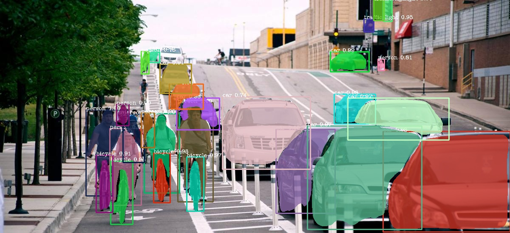
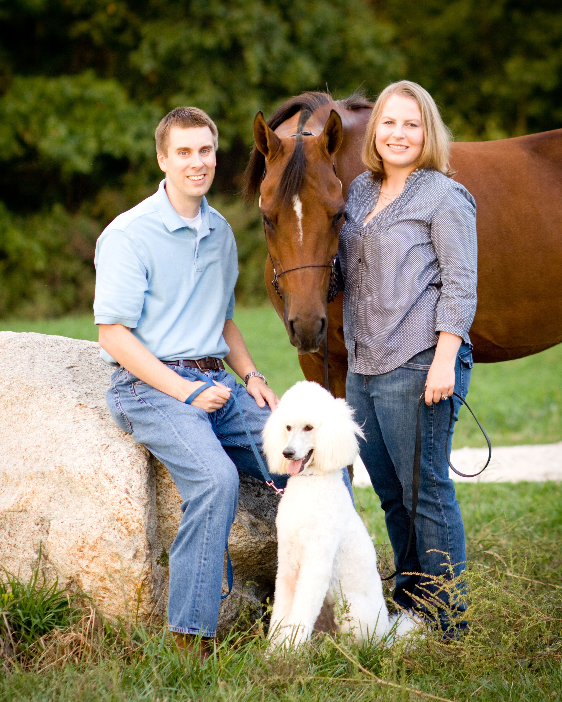
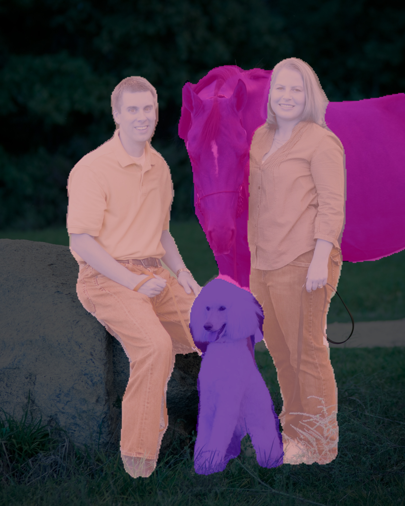
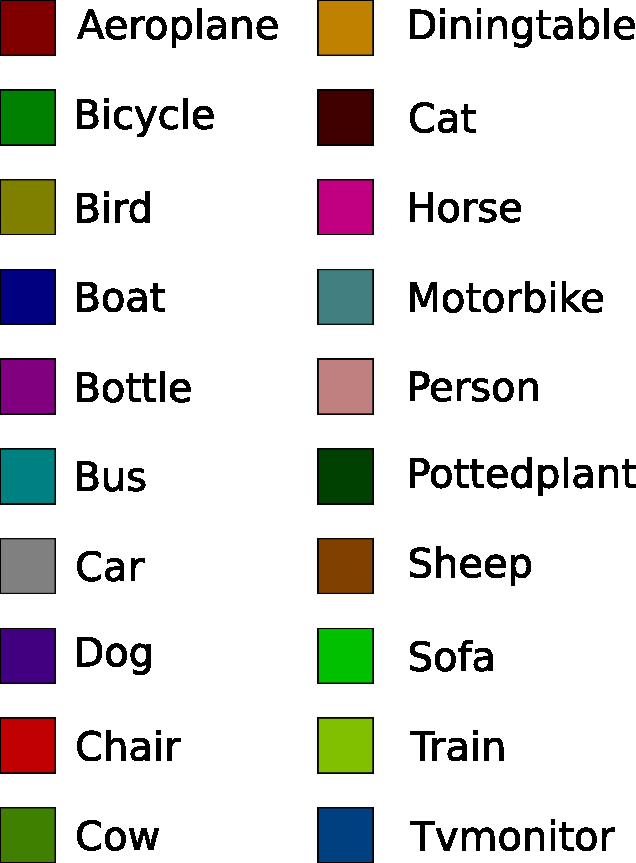
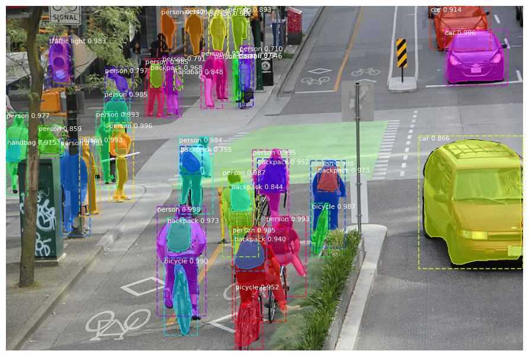

# PixelLib 
Pixellib is a library for performing segmentation of images. It supports the two major types of image segmentation: 

**1.Semantic segmentation**

**2.Instance segmentation**

You can implement both semantic and instance segmentation with few lines of code.

# Install PixelLib and its dependencies:

Install latest version of tensorflow(Tensorflow 2.0+) with:

**pip3 install tensorflow**

Install Pillow with:

**pip3 install pillow**

Install Opencv with:

**pip3 install opencv-python**

Install scikit-image with:

**pip3 install scikit-image**


## Install Pixellib with:
**pip3 install pixellib**

**Note:** The whl file of pixellib is not yet available on pypi, get it from [here](https://github.com/ayoolaolafenwa/PixelLib/releases/download/0.1.0/pixellib-0.1.0-py3-none-any.whl).

--[SEMANTIC SEGMENTATION WITH PIXELLIB](#semantic-segmentation-with-pixellib)


--[INSTANCE SEGMENTATION WITH PIXELLIB](#instance-segmentation-with-pixellib)


# SEMANTIC SEGMENTATION WITH PIXELLIB:
Pixellib is implemented with Deeplabv3+ framework to perform semantic segmentation.  Xception model pretrained on pascalvoc  is used for semantic segmentation. 

## Semantic segmentation with xception model pretrained on pascalvoc.
```python
import pixellib
from pixellib.semantic import semantic_segmentation

segment_image = semantic_segmentation()
segment_image.load_pascalvoc_model("deeplabv3_xception_tf_dim_ordering_tf_kernels.h5") 
segment_image.segmentAsPascalvoc("path_to_image", output_image_name = "path_to_output_image")

```
We shall take a look into each line of code....
```python
import pixellib
from pixellib.semantic import semantic_segmentation

#created an instance of semantic segmentation class
segment_image = semantic_segmentation()
```
The class for performing semantic segmentation is imported from pixellib and we created an instance of the class. 

```python
segment_image.load_pascalvoc_model("deeplabv3_xception_tf_dim_ordering_tf_kernels.h5") 
```
We called the function to load the xception model trained on pascal voc. The xception model can be download from [here](https://github.com/bonlime/keras-deeplab-v3-plus/releases/download/1.1/deeplabv3_xception_tf_dim_ordering_tf_kernels.h5).
 
```python
segment_image.segmentAsPascalvoc("path_to_image", output_image_name = "path_to_output_image")
```
This is the line of code that performs segmentation on an image and the segmentation is done in the pascalvoc's color format. This function takes in two parameters:

*path_to_image:* the path to the image to be segemented.

*path_to_output_image:* the path to save the output image. The image will be saved in your current working directory.

# sample1.jpg




```python
import pixellib
from pixellib.semantic import semantic_segmentation

segment_image = semantic_segmentation()
segment_image.load_pascalvoc_model("deeplabv3_xception_tf_dim_ordering_tf_kernels.h5") 
segment_image.segmentAsPascalvoc("sample1.jpg", output_image_name = "image_new.jpg")

```


Your saved image with all the objects present segmented.

You can obtain an image with segmentation overlay on the objects with a modified code below.

```python
segment_image.segmentAsPascalvoc("sample1.jpg", output_image_name = "image_new.jpg", overlay = True)
```

We added an extra parameter overlay set to true, we produced an image with segmentation overlay.



This xception model is trained with pascalvoc dataset with 20 common object categories. 

Objects and their corresponding color maps




# Specialised uses of PixelLib may require you to return the array of the segmentation’s output.

## Obtain the array of the segmentation’s output by using this code,
```python
output, segmap = segment_image.segmentAsPascalvoc()
```
## Obtain both the output and the segmentation overlay’s arrays by using this code,

```python
output, segoverlay = segment_image.segmentAsPascalvoc(overlay = True)
```

# INSTANCE SEGMENTATION WITH PIXELLIB:
The results obtained with semantic segmentation look great, but it may not be enough for some specific uses of image segmentation. In semantic segmentation objects of the same category are given the same colormap. For example if there are five people in an image, they will all be given the same colormap. Semantic segmentation might not provide adequate information about an image. The need for an effective image segmentation gives rise to the invention of *instance segmentation*. In instance segmentation objects of the same category are given different colormaps. 

Instance segmentation with Pixellib is based on MaskRCNN framework.

# Code to implement instance segmentation:

```python
import pixellib
from pixellib.instance import instance_segmentation

segment_image = instance_segmentation()
segment_image.load_model("mask_rcnn_coco.h5") 
segment_image.segmentImage("path_to_image", output_image_name = "output_image_path")

```
## Take a look at each line of code
```python
import pixellib
from pixellib.instance import instance_segmentation

segment_image = instance_segmentation()
```
The class for performing instance segmentation is imported and we created an instance of the class.

```python
segment_image.load_model("mask_rcnn_coco.h5") 
```
This is the code to load the mask rcnn model to perform instance segmentation. Download the mask rcnn model from [here](https://github.com/matterport/Mask_RCNN/releases/download/v2.0/mask_rcnn_coco.h5)

```python
segment_image.segmentImage("path_to_image", output_image_name = "output_image_path")
```
This is the code to perform instance segmentation on an image and it takes two parameters:

*path_to_image:* The path to the image to be predicted by the model.

*output_image_name:* The path to save the segmentation result. It will be saved in your current working directory.

# Sample2.jpg


```python
import pixellib
from pixellib.instance import instance_segmentation

segment_image = instance_segmentation()
segment_image.load_model("mask_rcnn_coco.h5") 
segment_image.segmentImage("sample2.jpg", output_image_name = "image_new.jpg")

```


This is the saved image in your directory. We can now observe the clear difference between semantic and instance segmentation. In instance segmentation all objects of the same category are given different colormaps. 


You can implement segmentation with bounding boxes. This can be achieved by modifying the code.

```python
segment_image.segmentImage("sample2.jpg", output_image_name = "image_new.jpg", show_bboxes = True)
```
You get a saved image with both segmentation masks and bounding boxes.


The Mask R_CNN model is trained on Coco dataset with 80 common object categories. The model can perform instance segmentation on these object categories. check this [text file](https://github.com/ayoolaolafenwa/PixelLib/blob/master/coco_object_categories.txt) to see a list of the 80 object categories.


# Specialised uses of PixelLib for Instance Segmentation.

## Obtain the following arrays:

-Detected Objects’ arrays

-Objects’ corresponding class_ids’ arrays

-Segmentation masks’ arrays

-Output’s array

## By using this code

```python
segmask, output = segment_image.segmentImage()
```

Segmentation with bounding boxes, modify the code by including the parameter ## show_bboxes.

```python
segmask, output = segment_image.segmentImage(show_bboxes = True)
```

## References
1. Bonlime, Keras implementation of Deeplab v3+ with pretrained weights  https://github.com/bonlime/keras-deeplab-v3-plus

2. Liang-Chieh Chen. et al, Encoder-Decoder with Atrous Separable Convolution for Semantic Image Segmentation https://arxiv.org/abs/1802.02611

3. Matterport, Mask R-CNN for object detection and instance segmentation on Keras and TensorFlow https://github.com/matterport/Mask_RCNN

4. Kaiming He et al, Mask R-CNN https://arxiv.org/abs/1703.06870

[Back To Top](#pixellib)
