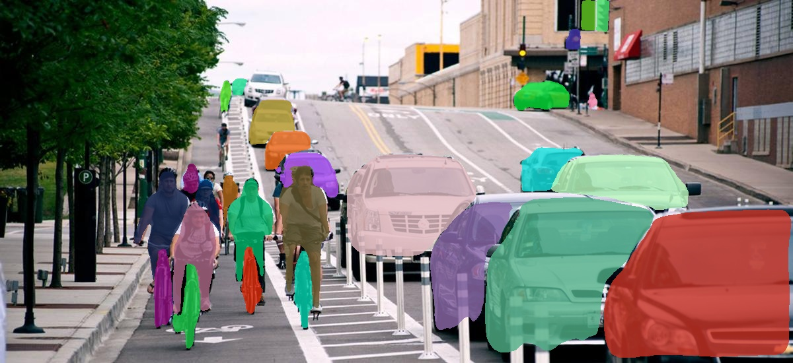
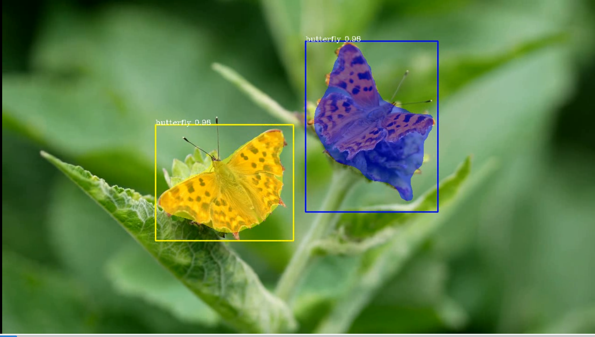
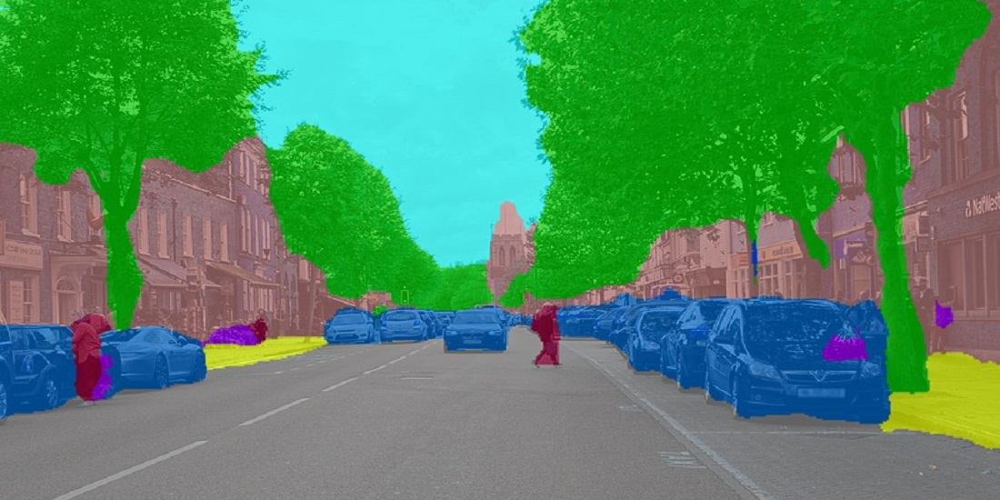

# PixelLib 

    

Pixellib is a library for performing segmentation of objects in images and videos. It supports the two major types of image segmentation: 

**1.Semantic segmentation**

**2.Instance segmentation**

Install PixelLib and its dependencies

# Install Tensorflow:

Install latest version of tensorflow(Tensorflow 2.0+) with:

**pip3 install tensorflow**

If you have have a pc enabled GPU, Install tensorflow--gpu's version that is compatible with the cuda's version on your pc:

**pip3 install tensorflow--gpu**

## Install Pixellib with:
**pip3 install pixellib**

**Visit PixelLib's official documentation on** [readthedocs](https://pixellib.readthedocs.io/en/latest/)

You can implement both semantic and instance segmentation with few lines of code.

There are two types of Deeplabv3+ models available for performing **semantic segmentation** with PixelLib:

1. Deeplabv3+ model with xception as network backbone trained on Ade20k dataset, a dataset with 150 classes of objects.
2. Deeplabv3+ model with xception as network backbone trained on Pascalvoc dataset, a dataset with 20 classes of objects. 

**Instance segmentation is implemented with PixelLib by using Mask R-CNN model trained on coco dataset.**

**The latest version of PixelLib supports custom training of object segmentation models using pretrained coco model.**

* [Instance Segmentation of Images With PixelLib Using Mask-RCNN COCO Model](#Instance-Segmentation-of-Images-With-PixelLib-Using-Mask-RCNN-COCO-Model)

* [Instance Segmentation of Videos With PixelLib Using Mask-RCNN COCO Model](##Instance Segmentation of Videos With PixelLib Using Mask-RCNN COCO Model)

* [Custom Instance Segmentation Training] (##Custom Instance Segmentation Training)

**Note** Deeplab and mask r-ccn models are available  in the [release](https://github.com/ayoolaolafenwa/PixelLib/releases) of this repository.

## [Instance Segmentation of Images With PixelLib Using Mask-RCNN COCO Model](Tutorials/image_instance.md)
Learn how to implement state of the art instance segmentation of objects with Mask-RCNN with PixelLib using 5 Lines of Code.

## [Instance Segmentation of Videos With PixelLib Using Mask-RCNN COCO Model](Tutorials/video_instance.md)
Implement state of the art instance segmentation of objects in video's feeds with Mask-RCNN model using 5 Lines of Code.

## [Custom Instance Segmentation Training](Tutorials/custom_train.md)
Perform instance segmentation on objects with your custom model with 7 Lines of Code.

## [Instance Segmentation of objects in images and videos With Custom Model](Tutorials/custom_train.md)

Perform inference on objects with your custom model.

## [Semantic Segmentation of Images With PixelLib Using Ade20k model](Tutorials/image_ade20k.md)
Learn how to perform state of the art semantic segmentation of 150 classes of objects with Ade20k model using 5 Lines of Code. Perform indoor and outdoor segmentation of scenes with PixelLib by using Ade20k model.

## [Semantic Segmentation of Videos With PixelLib Using Ade20k model](Tutorials/video_ade20k.md)
Implement state of the art semantic segmentation of 150 classes objects in video's feeds using Ade20k model with PixelLib using 5 Lines of Code.

## [Semantic Segmentation of Images With PixelLib Using Pascalvoc model](Tutorials/image_pascalvoc.md)
Learn how to perform state of the art semantic segmentation of 20 common objects with Pascalvoc model using 5 Lines of Code. Perform segmentation of unique objects with PixelLib by using Pascalvoc model.

## [Semantic Segmentation of Videos With PixelLib Using Pascalvoc model](Tutorials/video_pascalvoc.md)
Implement state of the art semantic segmentation of 20 unique objects in video's feeds using Pascalvoc model with PixelLib using 5 Lines of Code.

## Projects Using PixelLib
1. A segmentation api integrated with PixelLib to perform Semantic and Instance Segmentation of images on ios https://github.com/omarmhaimdat/segmentation_api

2. PixelLib is integerated in drone's cameras to perform instance segmentation of live video's feeds https://elbruno.com/2020/05/21/coding4fun-how-to-control-your-drone-with-20-lines-of-code-20-n/?utm_source=twitter&utm_medium=social&utm_campaign=tweepsmap-Default

## References
1. Bonlime, Keras implementation of Deeplab v3+ with pretrained weights  https://github.com/bonlime/keras-deeplab-v3-plus

2. Liang-Chieh Chen. et al, Encoder-Decoder with Atrous Separable Convolution for Semantic Image Segmentation https://arxiv.org/abs/1802.02611

3. Matterport, Mask R-CNN for object detection and instance segmentation on Keras and TensorFlow https://github.com/matterport/Mask_RCNN

4. Mask R-CNN code made compatible with tensorflow 2.0, https://github.com/tomgross/Mask_RCNN/tree/tensorflow-2.0

5. Kaiming He et al, Mask R-CNN https://arxiv.org/abs/1703.06870

6. TensorFlow DeepLab Model Zoo https://github.com/tensorflow/models/blob/master/research/deeplab/g3doc/model_zoo.md

7. Pascalvoc and Ade20k datasets' colormaps https://github.com/tensorflow/models/blob/master/research/deeplab/utils/get_dataset_colormap.py

[Back To Top](#pixellib)