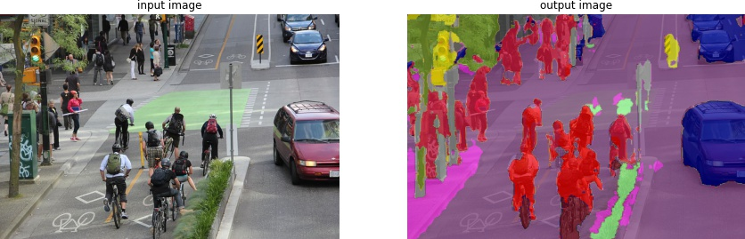

# PixelLib
Pixellib is a library for performing segmentation of images. It supports the two major types of image segmentation: 

**1.Semantic segmentation**

**2.Instance segmentation**

You can implement both semantic and instance segmentation with few lines of code.

# Install PixelLib and its dependencies:

Install latest version of tensorflow(Tensorflow 2.0+) with:

**pip3 install tensorflow**

Install Matplotlib with:

**pip3 install matplotlib**

Install Pillow with:

**pip3 install pillow**

Install Scipy with:

**pip3 install scipy**

Install Ipython with:

**pip3 install Ipython**

Install Skimage with:

**pip3 install scikit-image**

Install h5py with:

**pip3 install h5py**

## Install Pixellib with:
**pip3 install pixellib**

# SEMANTIC SEGMENTATION WITH PIXELLIB:
Pixellib is implemented with Deeplabv3+ framework to perform semantic segmentation.  Xception models pretrained on pascalvoc and cityscapes datasets are used for semantic segmentation. 

## Semantic segmentation with xception model pretrained on pascalvoc.
```python
from pixellib.semantic import semantic_segmentation

segment_image = semantic_segmentation()
segment_image.load_pascalvoc_model("deeplabv3_xception_tf_dim_ordering_tf_kernels.h5") 
segment_image.segmentAsPascalvoc("path_to_image", output_image_name = "path_to_output_image", segmap_only = True)

```
We shall take a look into each line of code....
```python
from pixellib.semantic import semantic_segmentation

#created an instance of semantic segmentation class
segment_image = semantic_segmentation()
```
The class for performing semantic segmentation is imported from pixellib and we created an instance of the class. 

```python
segment_image.load_pascalvoc_model("deeplabv3_xception_tf_dim_ordering_tf_kernels.h5") 
```
We called the function to load the xception model trained on pascal voc. 

```python
segment_image.segmentAsPascalvoc("path_to_image", output_image_name = "path_to_output_image", segmap_only = True)
```
This is the line of code that perform segmentation on an image and the segmentation is done in the pascalvoc color format. This function takes in three parameters:

*path_to_image:* the path to the image to be segemented.

*pth_to_output_image:* the path to save the output image.

*segmap_only:*  It is a parameter with a bolean value that determines the type of result obtained. If it is set to true only the segmentation map of the image is shown.If it is set to false it shows both the input image, segmentation overlay on the image and the segmentation map.


```python
from pixellib.semantic import semantic_segmentation

segment_image = semantic_segmentation()
segment_image.load_pascalvoc_model("deeplabv3_xception_tf_dim_ordering_tf_kernels.h5") 
segment_image.segmentAsPascalvoc("sample1.jpg", output_image_name = "output_image.jpg", segmap_only = True)

```


The segmentation mask of the image above. Only the segmentation map is shown because segmap_only is set to true.

```python
segment_image.segmentAsPascalvoc("path_to_image", output_image_name = "path_to_output_image", segmap_only = False)
```


When the parameter *segmap_only* is set to False the output result include the input image, segementation overlay of the image and the segmentation map of the image.


## Semantic segmentation with xception model pretrained on cityscapes.
```python
from pixellib.semantic import semantic_segmentation

segment_image = semantic_segmentation()
segment_image.load_cityscapes_model("deeplabv3_xception_tf_dim_ordering_tf_kernels_cityscapes.h5") 
segment_image.segmentAsCityscapes("/path_to_image", output_image_name = "output_image_path", segmap_only =True)

```
We shall take a look into each line of code....
```python
from pixellib.semantic import semantic_segmentation

#created an instance of semantic segmentation class
segment_image = semantic_segmentation()
```
The class for performing semantic segmentation is imported from pixellib and we created an instance of the class. 

```python
segment_image.load_cityscapes_model("deeplabv3_xception_tf_dim_ordering_tf_kernels_cityscapes.h5") 
```
We called the function to load the xception model trained on cityscapes. 

```python
segment_image.segmentAsCityscapes("path_to_image", output_image_name = "output_image_path", segmap_only =True)

```
This is the line of code that perform segmentation on an image and the segmentation is done in the cityscapes color format. This function takes in three parameters:

*path_to_image:* the path to the image to be segemented.

*path_to_output_image:* the path to save the output image.

*segmap_only:*  It is a parameter with a bolean value that determines the type of result obtained. If it is set to true only the segmentation map of the image is shown.If it is set to false it shows both the input image, segmentation overlay on the image and the segmentation map.


```python
from pixellib.semantic import semantic_segmentation

segment_image = semantic_segmentation()
segment_image.load_cityscapes_model("deeplabv3_xception_tf_dim_ordering_tf_kernels_cityscapes.h5") 
segment_image.segmentAsCityscapes("sample2.jpg", output_image_name = "image_new", segmap_only = True)

```


The segmentation mask of the image above. Only the segmentation map is shown because segmap_only is set to true.

```python
segment_image.segmentAsPascalvoc("path_to_image", output_image_name = "path_to_output_image", segmap_only = False)
```


When the parameter *segmap_only* is set to False the output result include the input image, segementation overlay of the image and the segmentation map of the image.

# INSTANCE SEGMENTATION WITH PIXELLIB:
The results obtained with semantic segmentation look great, but it may not be enough for some specific use of image segmentation. In semantic segmentation objects of the same category are given the same colormap. For example if there are five persons in an image, they will all be given the same colormap. Semantic segmentation might not provide adequate information about an image. The need for an effective image segmentation gives rise to invention of *instance segmentation*. In instance segmentation objects of the same category are given different colormaps. 
We shall observe the beautiful resuts of instance segmentation with pixellib by writing just few lines of code.

Instance segmentation with Pixellib is based on Mask_RCNN framework.

# Code to implement instance segmentation:

```python
from pixellib.instance import instance_segmentation

segment_image = instance_segmentation()
segment_image.load_model("mask_rcnn_coco.h5") 
segment_image.segmentImage("path_to_iamge", output_image_name = "output_image_path", show_boxes = True)

```
# Take a look at each line of code
```python
from pixellib.instance import instance_segmentation

segment_image = instance_segmentation()
```
The class for performing instance segmentation is imported and we created an instance of the class.

```python
segment_image.load_model("mask_rcnn_coco.h5") 
```
This is the code to load the mask rcnn model to perform instance segmentation.

```python
segment_image.segmentImage("path_to_image", output_image_name = "output_image_path", show_boxes = True)
```
This is the code to perform instance segmentation on an image and it takes three parameters.
*path_to_image:* The path to the image to be predicted by the model.

*output_image_name:* The path to save the segmentation result. It will be save in your current working directory.

*show_boxes:* This is a parameter with a boolean value it determined the type of segmentation result. If it is set to true it shows bounding boxes with their corresponding probabilities around each of the segmented objects in the image.

```python
from pixellib.instance import instance_segmentation

segment_image = instance_segmentation()
segment_image.load_model("mask_rcnn_coco.h5") 
segment_image.segmentImage("sample2.jpg", output_image_name = "image_new.jpg", show_boxes = True)

```

