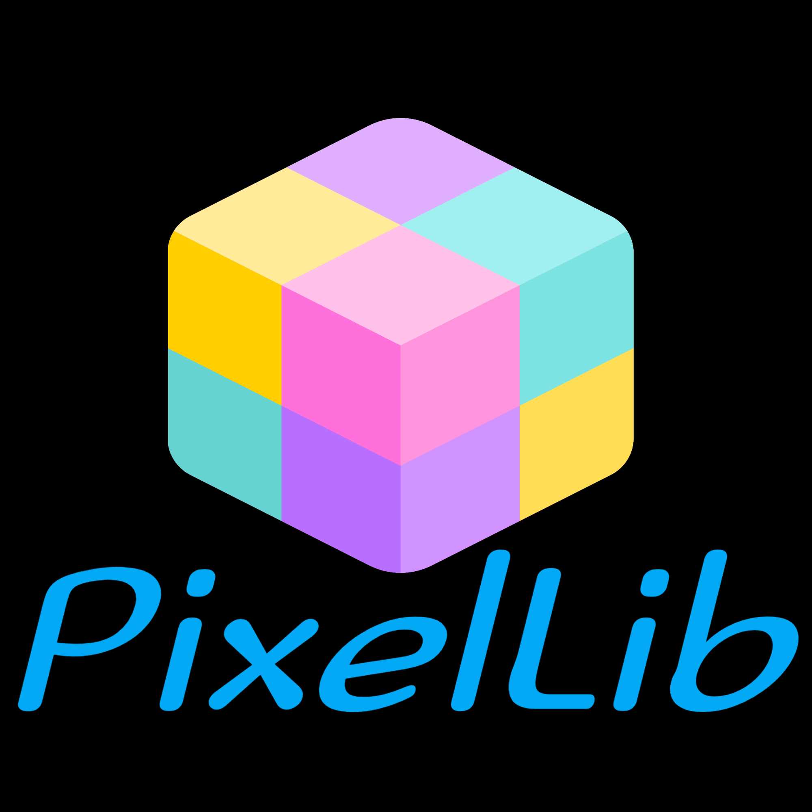
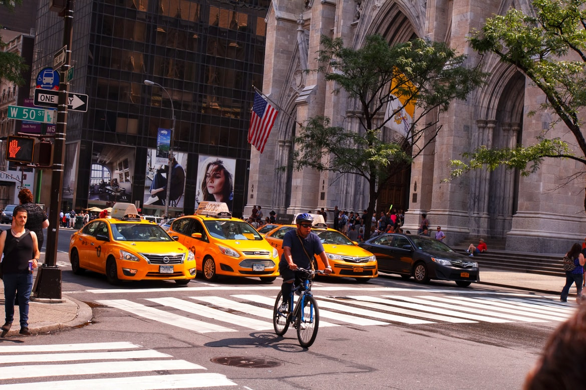
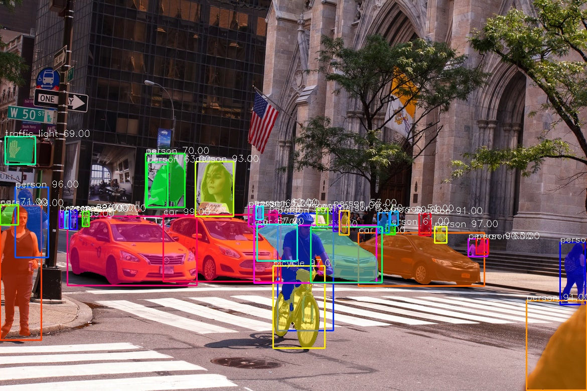
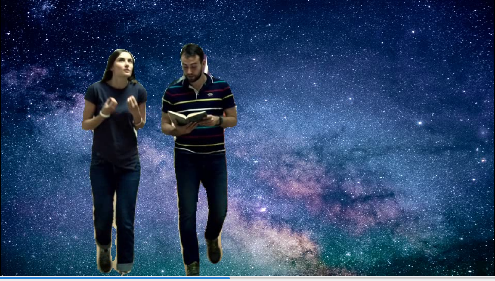
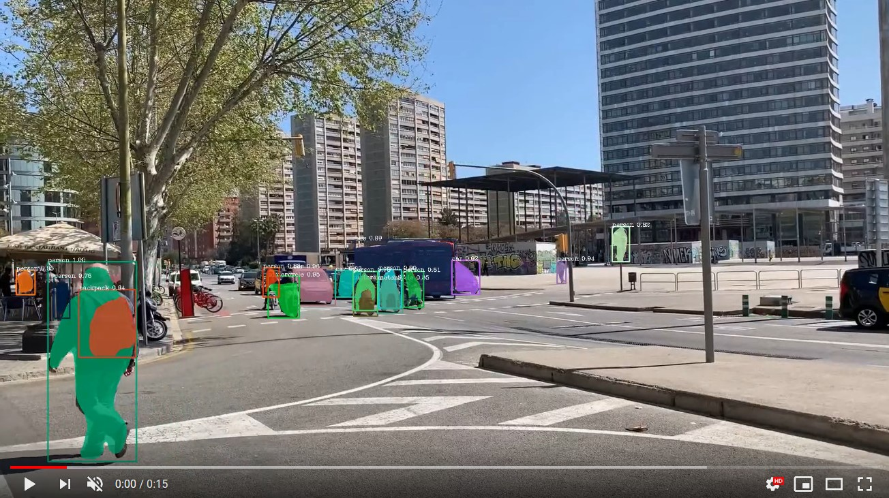
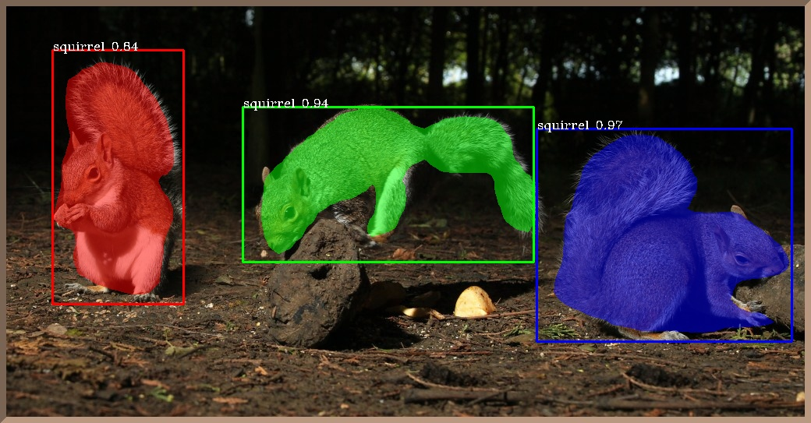
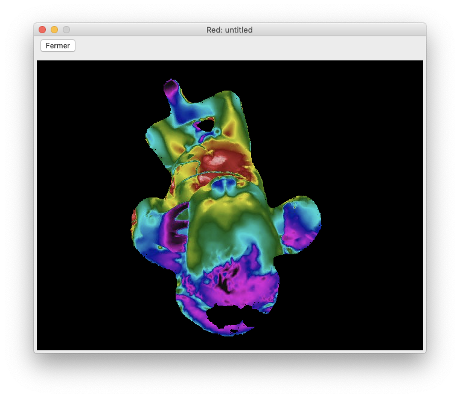
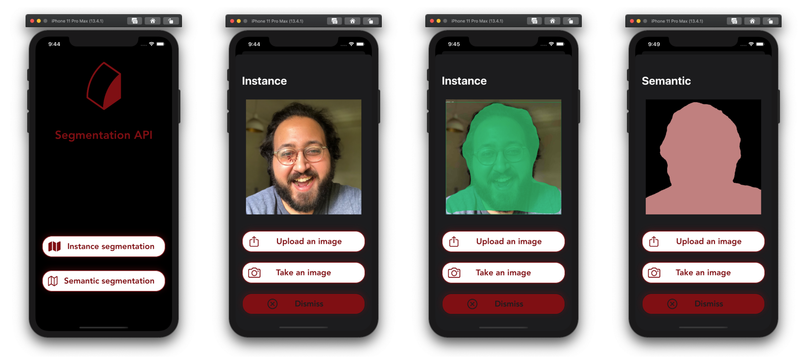
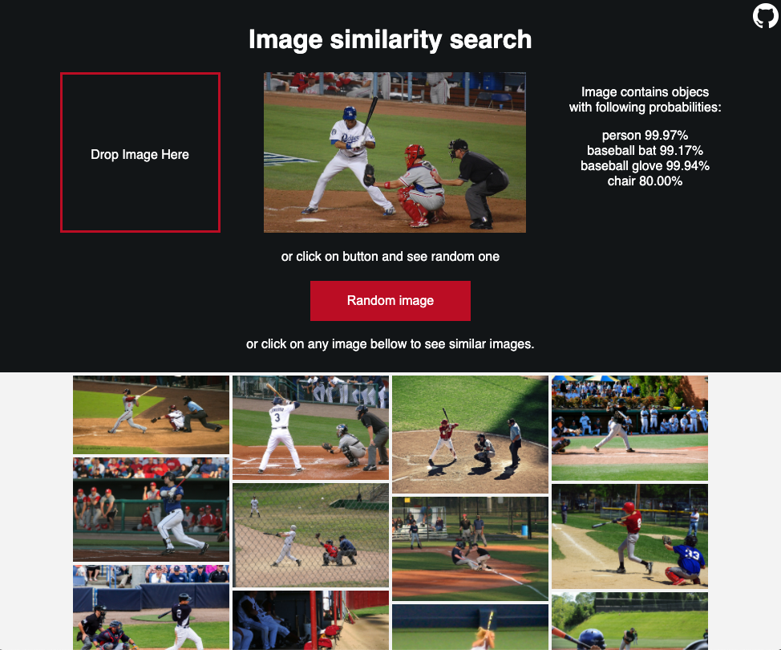

# PixelLib 

 <br> <br>


[](https://pepy.tech/project/pixellib)  [](https://pepy.tech/project/pixellib/month)  [](https://pepy.tech/project/pixellib/week) 


### Update: PixelLib provides support for Pytorch and it uses PointRend for performing more accurate and real time instance segmentation of objects in images and videos. Read the [tutorial](https://olafenwaayoola.medium.com/real-time-image-segmentation-using-5-lines-of-code-7c480abdb835) on how to use Pytorch and PointRend to perform instance segmentation in images and videos.

### Paper, *Simplifying Object Segmentation with PixelLib Library* is available on [paperswithcode](https://paperswithcode.com/paper/simplifying-object-segmentation-with-pixellib) <br> 


Pixellib is a library for performing segmentation of objects in images and videos. It supports the two major types of image segmentation: 

**1.Semantic segmentation**

**2.Instance segmentation**

PixelLib supports two deep learning libraries for image segmentation which are **Pytorch** and **Tensorflow**. 

# PixelLib Pytorch Version 

**The pytorch version of PixelLib uses PointRend object segmentation architecture by [Alexander Kirillov et al](https://arxiv.org/abs/1912.08193) to replace Mask R-CNN for performing instance segmentation of objects. PointRend is an excellent state of the art neural network for implementing object segmentation. It generates accurate segmentation masks and run at high inference speed that matches the increasing demand for an accurate and real time computer vision applications. PixelLib is a library built to provide support for different operating systems. I integrated PixelLib with the python implementation of [PointRend by Detectron2](https://github.com/facebookresearch/detectron2/tree/main/projects/PointRend) which supports only Linux OS. I made modifications to the original Detectron2 PointRend implementation to support Windows OS. The PointRend implementation used for PixelLib supports both Linux and Windows OS.**


<table>
  <tr>
    <td><h2> Mask R-CNN</h2> </td>
    <td><h2> PointRend </h2> </td>
  </tr>
  <tr>
    <td></td>
    <td></td>
  </tr>
  
 </table>

<table>
  <tr>
    <td><h2> Mask R-CNN </h2> </td>
    <td><h2> PointRend </h2></td>
  </tr>
  <tr>
    <td></td>
    <td></td>
  </tr>
  
 </table>


The sample images above are examples of the differences in the segmentation results of PointRend compared to Mask RCNN. It is obvious that the PointRend image results are better segmentation outputs compared to Mask R-CNN results.

## PointRend Instance Segmentation Records

#### Inference Speeds:

* **Using A TargetSize of *1333 * 800* : It achieves 0.26 seconds for processing a single image and 4fps for live camera feeds**. <br/>
* **Using A TargetSize of *667 * 447*: It achieves 0.20 seconds for processing a single image and 6fps for live camera feeds**.<br/>
* **Using A TargetSize of *333 * 200*: It achieves 0.15 seconds for processing a single image and 9fps for live camera feeds**.<br/>


### Install PixelLib and its dependencies

**Download Python**

PixelLib pytorch version supports python version 3.7 and above. Download a [compatible python version](https://www.python.org/).

**Install Pytorch**

PixelLib Pytorch version supports these versions of pytorch(1.6.0, 1.7.1,1.8.0 and 1.9.0).

*Note:* Pytorch 1.7.0 is not supported and do not use any pytorch version less than 1.6.0. Install a compatible [Pytorch version](https://pytorch.org/).

<br/>

**Install Pycocotools**
```
pip3 install pycocotools
```
<br/>

**Install PixelLib**
```
pip3 install pixellib
```
<br/>

If installed, upgrade to the latest version using:
```
pip3 install pixellib — upgrade
```


# Image Segmentation in 5 Lines of Code Using PointRend



```python

  import pixellib
  from pixellib.torchbackend.instance import instanceSegmentation

  ins = instanceSegmentation()
  ins.load_model("pointrend_resnet50.pkl")
  ins.segmentImage("image.jpg", show_bboxes=True, output_image_name="output_image.jpg")
```



### [Tutorial on Image Segmentation with Pytorch Using PointRend](Tutorials/Pytorch_image_instance_segmentation.md)
<br/>

# Video Segmentation in 5 Lines of Code Using PointRend

```python
  import pixellib
  from pixellib.torchbackend.instance import instanceSegmentation

  ins = instanceSegmentation()
  ins.load_model("pointrend_resnet50.pkl")
  ins.process_video("sample_video.mp4", show_bboxes=True, frames_per_second=3, output_video_name="output_video.mp4")
  
```

[](https://www.youtube.com/watch?v=o4Ies6YEces&list=PLtFkVrcr8LqNgbwdOb6of5X19ytm4ycHC&index=22&t=3s)

### [Tutorial on Video Segmentation with Pytorch Using PointRend](Tutorials/Pytorch_video_instance_segmentation.md)
<br/>

# Note

**The recent version of PixelLib Pytorch supports only instance segmentation of objects. Custom training will be released soon!!!!**
<br/>


# PixelLib Tensorflow Version 

PixelLib supports **tensorflow's version (2.0 - 2.4.1)**. Install tensorflow using:

```
pip3 install tensorflow
```

If you have have a pc enabled GPU, Install tensorflow--gpu's version that is compatible with the cuda installed on your pc:


```
pip3 install tensorflow--gpu
```


**Install Pixellib with**:

```
pip3 install pixellib --upgrade
```

**Visit PixelLib's official documentation on** [readthedocs](https://pixellib.readthedocs.io/en/latest/)


# Background Editing in Images and Videos with 5 Lines of Code:
PixelLib uses object segmentation to perform excellent foreground and background separation. It makes possible to alter the background of any image and video using just five lines of code.

#### The following features are supported for background editing,

**1.Create a virtual background for an image and a video**

**2.Assign a distinct color to the background of an image and a video**

**3.Blur the background of an image and a video**

**4.Grayscale the background of an image and a video** <br/> <br/>


```python
import pixellib
from pixellib.tune_bg import alter_bg

change_bg = alter_bg(model_type = "pb")
change_bg.load_pascalvoc_model("xception_pascalvoc.pb")
change_bg.blur_bg("sample.jpg", extreme = True, detect = "person", output_image_name="blur_img.jpg")
```


### [Tutorial on Background Editing in Images](Tutorials/change_image_bg.md)


```python
import pixellib
from pixellib.tune_bg import alter_bg

change_bg = alter_bg(model_type="pb")
change_bg.load_pascalvoc_model("xception_pascalvoc.pb")
change_bg.change_video_bg("sample_video.mp4", "bg.jpg", frames_per_second = 10, output_video_name="output_video.mp4", detect = "person")
```

[](https://www.youtube.com/watch?v=699Hyi6oZFs)

### [Tutorial on Background Editing in Videos](Tutorials/change_video_bg.md) <br/> <br/>


## Implement both semantic and instance segmentation with few lines of code.

There are two types of Deeplabv3+ models available for performing **semantic segmentation** with PixelLib:

1. Deeplabv3+ model with xception as network backbone trained on Ade20k dataset, a dataset with 150 classes of objects.
2. Deeplabv3+ model with xception as network backbone trained on Pascalvoc dataset, a dataset with 20 classes of objects. 

**Instance segmentation is implemented with PixelLib by using Mask R-CNN model trained on coco dataset.**

**The latest version of PixelLib supports custom training of object segmentation models using pretrained coco model.**

**Note:** PixelLib supports annotation with Labelme. If you make use of another annotation tool it will not be compatible with the library. Read this [tutorial](https://medium.com/@olafenwaayoola/image-annotation-with-labelme-81687ac2d077) on image annotation with Labelme.


* [Instance Segmentation of objects in Images and Videos with 5 Lines of Code](#Instance-Segmentation-of-objects-in-Images-and-Videos-with-5-Lines-of-Code)


* [Custom Training with 7 Lines of Code](#Custom-Training-with-7-Lines-of-Code)

* [Semantic Segmentation of 150 Classes of Objects in images and videos with 5 Lines of Code](#Semantic-Segmentation-of-150-Classes-of-Objects-in-images-and-videos-with-5-Lines-of-Code)

* [Semantic Segmentation of 20 Common Objects with 5 Lines of Code](#Semantic-Segmentation-of-20-Common-Objects-with-5-Lines-of-Code) 
* [Projects Using PixelLib](#Projects-Using-PixelLib)<br/> <br/>


**Note** Deeplab and mask r-ccn models are available  in the [release](https://github.com/ayoolaolafenwa/PixelLib/releases) of this repository.

# Instance Segmentation of objects in Images and Videos with 5 Lines of Code
PixelLib supports the implementation of instance segmentation  of objects in images and videos with Mask-RCNN using 5 Lines of Code.


```python

  import pixellib
  from pixellib.instance import instance_segmentation

  segment_image = instance_segmentation()
  segment_image.load_model("mask_rcnn_coco.h5") 
  segment_image.segmentImage("sample.jpg", show_bboxes = True, output_image_name = "image_new.jpg")
```


### [Tutorial on Instance Segmentation of Images](Tutorials/image_instance.md)

```python

  import pixellib
  from pixellib.instance import instance_segmentation

  segment_video = instance_segmentation()
  segment_video.load_model("mask_rcnn_coco.h5")
  segment_video.process_video("sample_video2.mp4", show_bboxes = True, frames_per_second= 15, output_video_name="output_video.mp4")
```

[](https://www.youtube.com/watch?v=bGPO1bCZLAo)

**[Tutorial on Instance Segmentation of Videos](Tutorials/video_instance.md) <br/> <br/>


# Custom Training with 7 Lines of Code
PixelLib supports the ability to train a custom segmentation model using just seven lines of code.

```python

   import pixellib
   from pixellib.custom_train import instance_custom_training

   train_maskrcnn = instance_custom_training()
   train_maskrcnn.modelConfig(network_backbone = "resnet101", num_classes= 2, batch_size = 4)
   train_maskrcnn.load_pretrained_model("mask_rcnn_coco.h5")
   train_maskrcnn.load_dataset("Nature")
   train_maskrcnn.train_model(num_epochs = 300, augmentation=True,  path_trained_models = "mask_rcnn_models")
```



**This is a result from a model trained with PixelLib.**

### [Tutorial on Custom Instance Segmentation Training](Tutorials/custom_train.md)


Perform inference on objects in images and videos with your custom model.


```python
  
  import pixellib
  from pixellib.instance import custom_segmentation

  test_video = custom_segmentation()
  test_video.inferConfig(num_classes=  2, class_names=["BG", "butterfly", "squirrel"])
  test_video.load_model("Nature_model_resnet101")
  test_video.process_video("sample_video1.mp4", show_bboxes = True,  output_video_name="video_out.mp4", frames_per_second=15)
```

[](https://www.youtube.com/watch?v=bWQGxaZIPOo)

### [Tutorial on Instance Segmentation of objects in images and videos With A Custom Model](Tutorials/custom_inference.md) <br/> <br/>


# Semantic Segmentation of 150 Classes of Objects in images and videos with 5 Lines of Code
PixelLib makes it possible to perform state of the art semantic segmentation of 150 classes of objects with Ade20k model using 5 Lines of Code. Perform indoor and outdoor segmentation of scenes with PixelLib by using Ade20k model.


```python

  import pixellib
  from pixellib.semantic import semantic_segmentation

  segment_image = semantic_segmentation()
  segment_image.load_ade20k_model("deeplabv3_xception65_ade20k.h5")
  segment_image.segmentAsAde20k("sample.jpg", overlay = True, output_image_name="image_new.jpg")
```


### [Tutorial on Semantic Segmentation of 150 Classes of Objects in Images ](Tutorials/image_ade20k.md)

```python

  import pixellib
  from pixellib.semantic import semantic_segmentation

  segment_video = semantic_segmentation()
  segment_video.load_ade20k_model("deeplabv3_xception65_ade20k.h5")
  segment_video.process_video_ade20k("sample_video.mp4", overlay = True, frames_per_second= 15, output_video_name="output_video.mp4")  
```

[](https://www.youtube.com/watch?v=hxczTe9U8jY)


### [Tutorial on Semantic Segmentation of 150 Classes of Objects Videos](Tutorials/video_ade20k.md) <br /> <br />


# Semantic Segmentation of 20 Common Objects with 5 Lines of Code
PixelLib supports the semantic segmentation of 20 unique objects.


```python

import pixellib
from pixellib.semantic import semantic_segmentation

segment_image = semantic_segmentation()
segment_image.load_pascalvoc_model("deeplabv3_xception_tf_dim_ordering_tf_kernels.h5") 
segment_image.segmentAsPascalvoc("sample.jpg", output_image_name = "image_new.jpg")
```


### [Tutorial on Semantic Segmentation of objects in Images With PixelLib Using Pascalvoc model](Tutorials/image_pascalvoc.md)

```python

  import pixellib
  from pixellib.semantic import semantic_segmentation

  segment_video = semantic_segmentation()
  segment_video.load_pascalvoc_model("deeplabv3_xception_tf_dim_ordering_tf_kernels.h5")
  segment_video.process_video_pascalvoc("sample_video1.mp4",  overlay = True, frames_per_second= 15, output_video_name="output_video.mp4")
```  
[](https://www.youtube.com/watch?v=l9WMqT2znJE)

### [Tutorial on Semantic Segmentation of objects in Videos With PixelLib Using Pascalvoc model](Tutorials/video_pascalvoc.md)<br/> <br/>


## Projects Using PixelLib
1. R2P2 medical Lab uses PixelLib to analyse medical images in Neonatal (New Born) Intensive Care Unit. https://r2p2.tech/#equipe
 <br/> <br/>

2. PixelLib is integerated in drone's cameras to perform instance segmentation of live video's feeds https://elbruno.com/2020/05/21/coding4fun-how-to-control-your-drone-with-20-lines-of-code-20-n/?utm_source=twitter&utm_medium=social&utm_campaign=tweepsmap-Default
 <br/> <br/>

3. A segmentation api integrated with PixelLib to perform Semantic and Instance Segmentation of images on ios https://github.com/omarmhaimdat/segmentation_api
 <br/> <br/>

4. PixelLib is used to perform image segmentation to find similar contents in images for image recommendation https://github.com/lukoucky/image_recommendation
 <br/> <br/>


## References
1. PointRend Detectron2 Implementation https://github.com/facebookresearch/detectron2/tree/main/projects/PointRend
2. Bonlime, Keras implementation of Deeplab v3+ with pretrained weights  https://github.com/bonlime/keras-deeplab-v3-plus

3. Liang-Chieh Chen. et al, Encoder-Decoder with Atrous Separable Convolution for Semantic Image Segmentation https://arxiv.org/abs/1802.02611

3. Matterport, Mask R-CNN for object detection and instance segmentation on Keras and TensorFlow https://github.com/matterport/Mask_RCNN

5. Mask R-CNN code made compatible with tensorflow 2.0, https://github.com/tomgross/Mask_RCNN/tree/tensorflow-2.0

6. Kaiming He et al, Mask R-CNN https://arxiv.org/abs/1703.06870

7. TensorFlow DeepLab Model Zoo https://github.com/tensorflow/models/blob/master/research/deeplab/g3doc/model_zoo.md

8. Pascalvoc and Ade20k datasets' colormaps https://github.com/tensorflow/models/blob/master/research/deeplab/utils/get_dataset_colormap.py

9. Object-Detection-Python https://github.com/Yunus0or1/Object-Detection-Python

[Back To Top](#pixellib)
