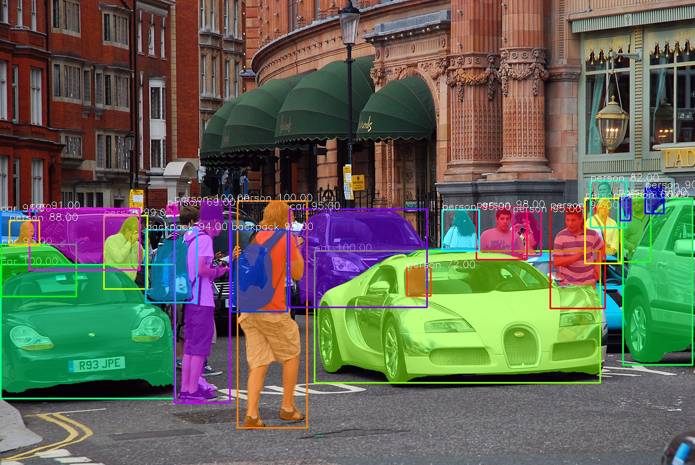
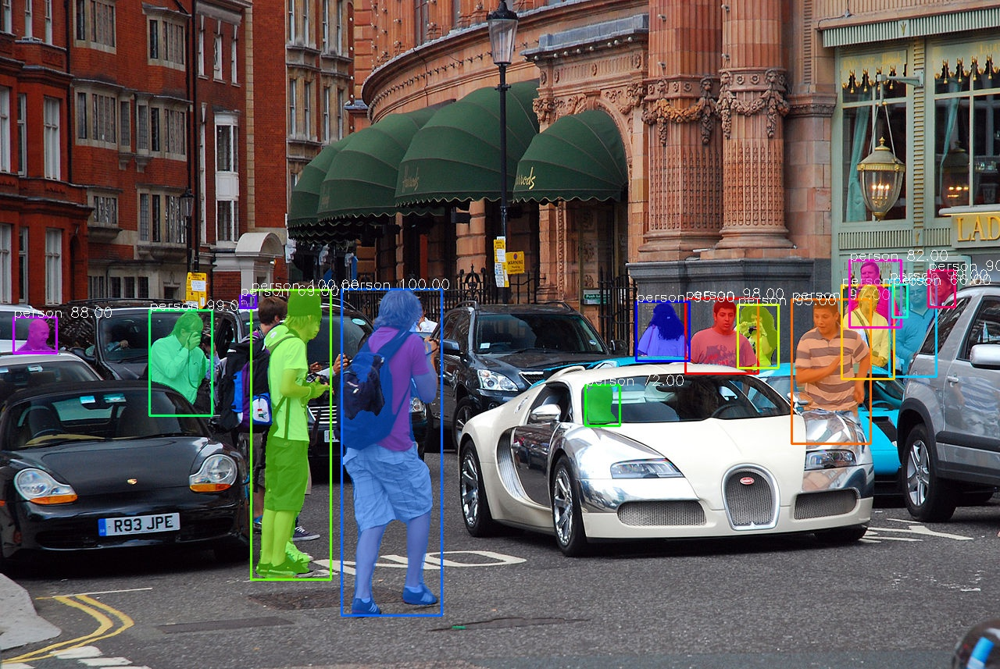

# Instance Segmentation of Images in Pytorch

PixelLib uses five lines of python code for performing object segmentation in images and videos with PointRend model. Download the [PointRend model](https://github.com/ayoolaolafenwa/PixelLib/releases/download/0.2.0/pointrend_resnet50.pkl). This is the code for image segmentation.

``` python
import pixellib
from pixellib.torchbackend.instance import instanceSegmentation

ins = instanceSegmentation()
ins.load_model("pointrend_resnet50.pkl")
ins.segmentImage("image.jpg", show_bboxes=True, output_image_name="output_image.jpg")
```

**Line 1–4:** PixelLib package was imported and we also imported the class instanceSegmentation from the the module pixellib.torchbackend.instance (importing instance segmentation class from pytorch support). We created an instance of the class and finally loaded the PointRend model we have downloaded.

**Line 5:** We called the function segmentImage to perform segmentation of objects in images and added the following parameters to the function:

 * image_path: This is the path to the image to be segmented.

 * show_bbox: This is an optional parameter to show the segmented results with bounding boxes.

 * output_image_name: This is the name of the saved segmented image. 

## Sample Image for Segmentation

 

<br/>
<br/>

``` python
ins.segmentImage("image.jpg",output_image_name="output.jpg")
```

## Image after Segmentation

 

<br/> <br/>

```
The checkpoint state_dict contains keys that are not used by the model: proposal_generator.anchor_generator.cell_anchors.{0, 1, 2, 3, 4}
```

**This log above may appeared if you are running the segmentation code! It is not an error and the code will work fine!**

 <br/> 
 <br/>

## Obtain Segmentation Results
``` python
results, output = ins.segmentImage("image.jpg", show_bboxes=True, output_image_name="result.jpg")
print(results)
```

The segmentation results return a dictionary with a lot of values associated with the objects segmented in the image. The results printed will be in the following format: 

```
{'boxes':  array([[ 579,  462, 1105,  704],
       [   1,  486,  321,  734],
       [ 321,  371,  423,  742],
       [ 436,  369,  565,  788],
       [ 191,  397,  270,  532],
       [1138,  357, 1197,  482],
       [ 877,  382,  969,  477],),

'class_ids': array([ 2,  2,  0,  0,  0,  0,  0,  2,  0,  0,  0,  0,  2, 24, 24,2,  2,2,  0,  0,  0,  0,  0,  0], dtype=int64), 

'class_names': ['car', 'car', 'person', 'person', 'person', 'person', 'person', 'car', 'person', 'person', 'person', 'person', 'car', 'backpack', 'backpack', 'car', 'car', 'car', 'person', 'person', 'person', 'person', 'person', 'person'],
 'object_counts': Counter({'person': 15, 'car': 7, 'backpack': 2}), 

'scores': array([100., 100., 100., 100.,  99.,  99.,  98.,  98.,  97.,  96.,  95.,95.,  95.,  95.,  94.,  94.,  93.,  91.,  90.,  88.,  82.,  72.,69.,  66.], dtype=float32), 

'masks': array([[[False, False, False, ..., False, False, False],
[False, False, False, ..., False, False, False],
'extracted_objects': []
```
<br/>

## Values from The Results Printed Above Include: <br/>

**boxes:** These are the bounding boxes coordinates of the objects segmented. I did not display all the boxes coordinates, this is because the list would have been too long.  <br/> 

```
'boxes':  array([[ 579,  462, 1105,  704],
       [   1,  486,  321,  734],
       [ 321,  371,  423,  742],
       [ 436,  369,  565,  788],
       [ 191,  397,  270,  532],
       [1138,  357, 1197,  482],
       [ 877,  382,  969,  477],),
```
<br/>

**class_ids:** These are the class ids of the objects segmented. 
```
'class_ids': array([ 2,  2,  0,  0,  0,  0,  0,  2,  0,  0,  0,  0,  2, 24, 24,2,  2,2,  0,  0,  0,  0,  0,  0], dtype=int64),
```
<br/>

**class_names:** These are the class names of the objects segmented. 
```
'class_names': ['car', 'car', 'person', 'person', 'person', 'person', 'person', 'car', 'person', 'person', 'person', 'person', 'car', 'backpack', 'backpack', 'car', 'car', 'car', 'person', 'person', 'person', 'person', 'person', 'person'],
```
<br/>

**object_counts:** These are the counts of each of the classes segmented in the image. I used the python inbuilt counter to count the objects. In this case there are 15 persons, 7 cars, and 2 backpacks segmented in the image.  
```
'object_counts': Counter({'person': 15, 'car': 7, 'backpack': 2}),
```
<br/>

**scores:** These are the confidence scores for each of the objects segmented. <br/>

```
'scores': array([100., 100., 100., 100.,  99.,  99.,  98.,  98.,  97.,  96.,  95.,95.,  95.,  95.,  94.,  94.,  93.,  91.,  90.,  88.,  82.,  72.,69.,  66.], dtype=float32),
```
<br/>

**masks:** These are the mask values of each of the objects segmented. I did not display all the mask values, this is because the list would have been too long. 

```
'masks': array([[[False, False, False, ..., False, False, False],
[False, False, False, ..., False, False, False],
```
<br/>


## Note <br/>
The default values of masks returned are in bolean. It is possible to obtain the masks' coordinates by using a new parameter **mask_points_values**.

``` python
ins.segmentImage("sample.jpg", show_bboxes=True, mask_points_values=True,  output_image_name="output.jpg")
``` 
<br/>

**mask_points_values** parameter was added to the segmentImage function and set to true and the new mask values will be:
```
[[array([[295, 497]])
  array([[422, 114], 
       [421, 115],   
       [417, 115],
       ...,
       [436, 115],
       [433, 115],
       [432, 114]])]]
``` 
<br/> 

**extracted_objects:** This is the container value for the extracted objects values if we extract objects. It is empty, because we did not extract anything. We shall discuss later in this article on how to extract these segmented objects. <br/> <br/>

```python
results, output = ins.segmentImage("image.jpg", show_bboxes=True, output_image_name="result.jpg")
```
## Access Values Rendered by The Segmentation Results  
<br/>

**Bounding box coordinate values**
```python
results["boxes"]
```
<br/>

**Class ids values**

``` python
results["class_ids"]
```
<br/>

**Class names values**
``` python
results["class_names"]
```
<br/>

**Object counts values**

``` python
results["object_counts"]
```
<br/>

**Mask values**

```python
results["masks"]
```

<br/> <br/>

## Detection Threshold 

PixelLib makes it possible to determine the detection threshold of object segmentation. <br/>
```python
ins.load_model("pointrend_resnet50.pkl", confidence = 0.3)
```
**confidence:** This is a new parameter introduced in the load_model function and it is set to **0.3** to threshold the detections by 30%. The default value I set for detection threshold is **0.5** and it can be increased or decreased using the confidence parameter.
<br/> <br/>

# Speed Records

PixelLib makes it possible to perform real time object segmentation and added the ability to adjust the inference speed to suit real time predictions. The default inference speed for processing a single image using Nvidia GPU with 4GB capacity is about **0.26** seconds. 
<br/>

**Speed Adjustments**
PixelLib supports speed adjustments and there are two types of speed adjustment modes which are fast and rapid mode;

**1 Fast Mode**
``` python
ins.load_model("pointrend_resnet50.pkl", detection_speed = "fast")
```
In the load_model function we added the parameter **detection_speed** and set the value to **fast**. The fast mode achieves **0.20** seconds for processing a single image. <br/> <br/>

## Full Code for Fast Mode Detection
``` python
import pixellib
from pixellib.torchbackend.instance import instanceSegmentation

ins = instanceSegmentation()
ins.load_model("pointrend_resnet50.pkl", detection_speed = "fast")
ins.segmentImage("image.jpg", show_bboxes=True, output_image_name="output_image.jpg")
```

**2 Rapid Mode**

``` python
ins.load_model("pointrend_resnet50.pkl", detection_speed = "fast")
```
<br/>

In the **load_model** function we added the parameter **detection_speed** and set the value to **rapid*. The rapid mode achieves **0.15** seconds for processing a single image.

## Full Code for Rapid Mode Detection
``` python
import pixellib
from pixellib.torchbackend.instance import instanceSegmentation

ins = instanceSegmentation()
ins.load_model("pointrend_resnet50.pkl", detection_speed = "rapid")
ins.segmentImage("image.jpg", show_bboxes=True, output_image_name="output_image.jpg")
```

# PointRend Models

There are two types of PointRend models used for object segmentation and they are of resnet50 variant and resnet101 variant. The resnet50 variant is used throughout this article because it is faster and of good accuracy. The resnet101 variant is more accurate but it is slower than resnet50 variant. According to the official reports of the models on Detectron2 the resnet50 variant achieves **38.3 mAP** on COCO and resnet101 variant achieves **40.1 mAP** on COCO.
 <br/>

**Speed Records for Resnet101:** The default speed for segmentation is 0.5 seconds, fast mode is 0.3 seconds and while the rapid mode is **0.25** seconds. 
<br/>

**Code for Resnet101 variant**
```python
import pixellib
from pixellib.torchbackend.instance import instanceSegmentation

ins = instanceSegmentation()
ins.load_model("pointrend_resnet101.pkl", network_backbone="resnet101")
ins.segmentImage("sample.jpg",  show_bboxes = True, output_image_name="output.jpg")
```
```python
ins.load_model("pointrend_resnet101.pkl", network_backbone = "resnet101")
```

The code for performing inference with the resnet101 model is the same, except we loaded the PointRend resnet101 model in the load_model function. Download the resnet101 model from [here](https://github.com/ayoolaolafenwa/PixelLib/releases/download/0.2.0/pointrend_resnet101.pkl). We also added an extra parameter network_backbone and set the value to resnet101. 

**Note** If you want to achieve high inference speed and good accuracy use the PointRend resnet50 variant, but if you are more concerned about accuracy use the PointRend resnet101 variant. All these inference reports are based on using Nvidia GPU with 4GB capacity.
<br/>
<br/>

# Custom Object Detection in Image Segmentation

The PointRend model used is a pretrained COCO model which supports 80 classes of objects. PixelLib supports custom object detection which makes it possible to filter detections and ensure the segmentation of target objects. We can choose out of the 80 classes of objects supported to match our target goal. These are the 80 classes of objects supported:
```
person, bicycle, car, motorcycle, airplane,
bus, train, truck, boat, traffic_light, fire_hydrant, stop_sign,
parking_meter, bench, bird, cat, dog, horse, sheep, cow, elephant, bear, zebra,
giraffe, backpack, umbrella, handbag, tie, suitcase, frisbee, skis, snowboard,
sports_ball, kite, baseball_bat, baseball_glove, skateboard, surfboard, tennis_racket,
bottle, wine_glass, cup, fork, knife, spoon, bowl, banana, apple, sandwich, orange,
broccoli, carrot, hot_dog, pizza, donut, cake, chair, couch, potted_plant, bed,
dining_table, toilet, tv, laptop, mouse, remote, keyboard, cell_phone, microwave,
oven, toaster, sink, refrigerator, book, clock, vase, scissors, teddy_bear, hair_dryer,
toothbrush.
```
We want to filter the detections of our sample image to detect only person in the image.
```python
target_classes = ins.select_target_classes(person = True)
ins.segmentImage("image.jpg", segment_target_classes = target_classes, output_image_name="output.jpg")
```
The function **select_target_classes** function was called to select the target objects to be segmented. The function segmentImage got a new parameter segment_target_classes to choose from the target classes and filter the detections based on them.



**Great!!! PixelLib detects only the people present in the image.**

<br/> 
<br/>


## Full Code for Custom Object Detection
```python
import pixellib
from pixellib.torchbackend.instance import instanceSegmentation

ins = instanceSegmentation()
ins.load_model("pointrend_resnet50.pkl")
target_classes = ins.select_target_classes(person = True)
ins.segmentImage("image.jpg", show_bboxes=True, segment_target_classes = target_classes, output_image_name="output_image.jpg")
```
<br/>
<br/>

# Object Extractions in Images

PixelLib makes it possible to extract and analyse objects segmented in an image. 

**Code for Object Extraction**
```python
import pixellib
from pixellib.torchbackend.instance import instanceSegmentation

ins = instanceSegmentation()
ins.load_model("pointrend_resnet50.pkl")
ins.segmentImage("image.jpg", show_bboxes=True, extract_segmented_objects=True,
save_extracted_objects=True, output_image_name="output_image.jpg")
```
<br/>
The code for image segmentation is the same except we added extra parameters in the segmentImage function to perform object extraction.
```python
ins.segmentImage("image.jpg", extract_segmented_objects = True, save_extracted_objects = True, output_image_name="output.jpg")
```

**extract_segmented_objects:** This is the parameter that handles the extraction of segmented objects. Access the extracted object values using:

```python
results, output = ins.segmentImage("image.jpg", show_bboxes=True, output_image_name="result.jpg")

#access the extracted objects from the results
results["extracted_objects"]
```
<br/>

**save_extracted_objects:** This is the parameter that will save each of the extracted objects as an image. Each of the segmented objects will be saved as segmented_object_index e.g segmented_object_1. The objects are saved based on the order in which they are extracted. 

```
segmented_object_1.jpg
segmented_object_2.jpg
segmented_object_3.jpg
segmented_object_4.jpg
segmented_object_5.jpg
segmented_object_6.jpg
```

<table>
  <tr>
    <td></td>
    <td></td>
  </tr>
  
 </table>

**Extracted Objects from Mask coordinates**
 

<br/> 

**Note**
All the objects in the image are extracted and I chose to display only two of them.
<br/> <br/>

## Extraction from Bounding Box Coordinates

The default extraction method extracts objects from the masks coordinates. The extraction only gives us information about the object itself and excludes its close surrounding. Consider a problem where we want to analyse the object and the region in which it is located in the image. PixelLib is able to solve this problem by extracting segmented objects together with their remote locations in the image using their bounding boxes coordinates.

## Modified Code for Extraction
```python
ins.segmentImage("image.jpg", extract_segmented_objects = True, extract_from_box = True, save_extracted_objects = True, output_image_name="output.jpg")
```
<br/>
We introduced a new parameter extract_from_box to extract the objects segmented from their bounding box coordinates. Each of the extracted objects will be saved as object_extract_index e.g object_extract_1. The objects are saved based on the order in which they are extracted.
```
object_extract1.jpg
object_extract2.jpg
object_extract3.jpg
object_extract4.jpg
object_extract5.jpg
object_extract6.jpg
```


<table>
  <tr>
    <td></td>
    <td></td>
  </tr>
  
 </table>

**Extracted Objects from Box coordinates**

## Full Code for Object Extraction using Bounding Box Coordinates
``` python
import pixellib
from pixellib.torchbackend.instance import instanceSegmentation

ins = instanceSegmentation()
ins.load_model("pointrend_resnet50.pkl")
ins.segmentImage("image.jpg", show_bboxes=True, extract_segmented_objects=True, extract_from_box = True,
save_extracted_objects=True, output_image_name="output_image.jpg" )
```
<br/>
<br/>

# Image Segmentation Output Visualization

PixelLib makes it possible to regulate the visualization of images according to their resolutions. 
```python
ins.segmentImage("sample.jpg", show_bboxes=True, output_image_name= "output.jpg")
```


The visualization wasn't visible because the text size, and box thickness are too slim. We can regulate the text size, thickness, and box thickness to regulate the visualizations.

## Modifications for Better Visualization

```python
ins.segmentImage("sample.jpg", show_bboxes=True, text_size=5, text_thickness=3, box_thickness=8, output_image_name="output.jpg")
```
The segmentImage function accepted new parameters that regulate the thickness of texts and bounding boxes.

**text_size:** The default text size is 0.6 and it is okay with images with moderate resolutions. It will be too small for images with high resolutions.

**text_thickness:** The default text thickness is 1. I increased it to 4 to match the image resolution.

**box_thickness:** The default box thickness is 2 and I changed it to 10 to match the image resolution.
<br/>
<br/>

## Output Image with A Better Visualization


<br/>
<br/>

**Note** 
Regulate the parameters according to the resolutions of your images. The values I used for this sample image whose resolution is 5760 x 3840 might be too large if your image resolutions is lower. You can increase the values of the parameters beyond the ones I set in this sample code if you have images whose resolutions are very high. text_thickness and box_thickness parameters' values must be in integers and do not express their values in floating point numbers. text_size value can be expressed in both integers and floating point numbers.
<br/>
<br/>


# Batch Image Segmentation
PixelLib makes it possible to perform prediction on a batch of images located in the same folder. 
<br/>

## Code for Batch Segmentation
```python
import pixellib
from pixellib.torchbackend.instance import instanceSegmentation

ins = instanceSegmentation()
ins.load_model("pointrend_resnet50.pkl")
ins.segmentBatch("inputfolder", show_bboxes=True, output_folder_name="outputfolder")
```
```python
ins.segmentBatch("inputfolder",  show_bboxes=True, output_folder_name = "outputfolder")
```
The code for batch segmentation is very similar to the single image segmentation except we replaced the segmentImage function with segmentBatch function. We added the following parameters to segmentBatch:
**folder_path:** This is the folder containing the images we want to segment.
**output_folder_name:** This is the name of the folder that we will save all the segmented images. 

sample folder structure
```
--input_folder
    --test1.jpg
    --test2.jpg
    --test3.jpg

--output_folder 
    --test1.jpg
    --test2.jpg
    --test3.jpg
```   
## Code for Extraction of Objects in Batch Image Segmentation
```python
import pixellib
from pixellib.torchbackend.instance import instanceSegmentation

ins = instanceSegmentation()
ins.load_model("pointrend_resnet50.pkl")
ins.segmentBatch("inputfolder", show_bboxes=True, extract_segmented_objects=True, extract_from_box=True,
save_extracted_objects=True, output_folder_name="outputfolder")
```
<br/>
<br/>

## Code for Custom Object Segmentation in Batch Image Segmentation
```python
import pixellib
from pixellib.torchbackend.instance import instanceSegmentation

ins = instanceSegmentation()
ins.load_model("pointrend_resnet50.pkl")
target_classes = ins.select_target_classes(person = True)
ins.segmentBatch("inputfolder", show_bboxes=True, segment_target_classes = target_classes, output_folder_name="outputfolder")
```

## Code for fast mode detection in Batch Image Segmentation
```python
import pixellib
from pixellib.torchbackend.instance import instanceSegmentation

ins = instanceSegmentation()
ins.load_model("pointrend_resnet50.pkl", detection_speed = "fast")
ins.segmentBatch("inputfolder", show_bboxes=True, output_folder_name="outputfolder")
```
<br/>
<br/>

## Code for rapid mode detection in Batch Image Segmentation
```python
import pixellib
from pixellib.torchbackend.instance import instanceSegmentation

ins = instanceSegmentation()
ins.load_model("pointrend_resnet50.pkl", detection_speed = "rapid")
ins.segmentBatch("inputfolder", show_bboxes=True, output_folder_name="outputfolder")
```

<br/>
<br/>

**Note** 
The code implementation of batch image segmentation for all supported features of PixelLib is the same as the single image segmentation with the exception of **segmentBatch** function to replace **segmentImage** function.
