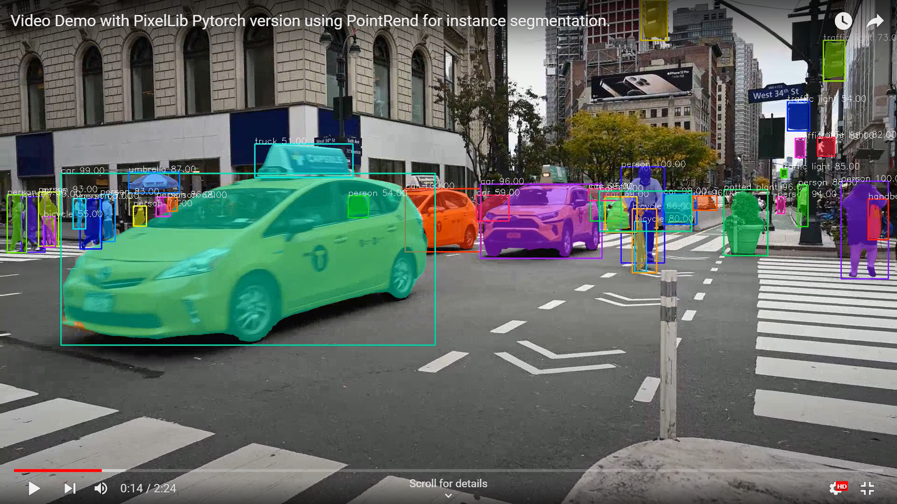

# Instance Segmentation of Videos and Live Cameras Feeds in Pytorch

PixelLib makes it possible to perform real time object segmentation in live camera feeds and video files.


## Code for Video Segmentation
```python
import pixellib
from pixellib.torchbackend.instance import instanceSegmentation

ins = instanceSegmentation()
ins.load_model("pointrend_resnet50.pkl")
ins.process_video("sample_video.mp4", show_bboxes=True, frames_per_second=3, output_video_name="output_video.mp4")
```
<br/>
<br/>

**Line 1–4:** PixelLib package was imported and we also imported the class instanceSegmentation from the the module pixellib.torchbackend.instance (importing instance segmentation class from pytorch support). We created an instance of the class and finally loaded the PointRend model. Download the model from [here](https://github.com/ayoolaolafenwa/PixelLib/releases/download/0.2.0/pointrend_resnet50.pkl).

**Line 5:** We called the function process_video to perform segmentation of objects in videos and the following parameters are added to the function:

**video_path:** This is the path to the video to be segmented.

**show_bboxes:** This is an optional parameter to display the segmented objects in the results with bounding boxes.

**frames_per_second:** This is the parameter that will set the number of frames per second for the saved video.

**output_video_name:** This is the name of output segmented video.

```python
ins.process_video("sample_video.mp4", show_bboxes=True, frames_per_second=3, output_video_name="output_video.mp4")
```
[](https://www.youtube.com/watch?v=o4Ies6YEces)
<br/>
<br/>

## Code for Object Extraction in Videos
```python
import pixellib
from pixellib.torchbackend.instance import instanceSegmentation

ins = instanceSegmentation()
ins.load_model("pointrend_resnet50.pkl")
ins.process_video("sample.mp4", show_bboxes=True, extract_segmented_objects=True,
save_extracted_objects=True, frames_per_second=3, output_video_name="output_video.mp4")
```
<br/>


``` python
ins.process_video("sample_video.mp4", show_bboxes=True,  extract_segmented_objectsframes_per_second=5, output_video_name="output_video.mp4")
```
The process_video function have new parameters extract_segmented_objects and save_extracted_objects to extract and save segmented objects respectively.


<table>
  <tr>
    <td></td>
    <td></td>
    <td></td>
  </tr>
  
 </table>

## Extraction from Bounding Box Coordinates in Videos


**Modified Code for Extraction**
```python
import pixellib
from pixellib.torchbackend.instance import instanceSegmentation

ins = instanceSegmentation()
ins.load_model("pointrend_resnet50.pkl")
ins.segmentImage("image.jpg", show_bboxes=True, extract_segmented_objects=True, extract_from_box = True,
save_extracted_objects=True, output_image_name="output_image.jpg" )
```
```python
ins.process_video("sample.mp4", show_bboxes=True, extract_segmented_objects=True, extract_from_box=True,save_extracted_objects=True, frames_per_second=5, output_video_name="output_video.mp4")
```
**extract_from_box** was added to the function to extract the objects segmented from their bounding box coordinates.

<table>
  <tr>
    <td></td>
    <td></td>
    <td></td>
  </tr>
  
 </table>


## Custom Object Segmentation in Videos

PixelLib makes it possible to perform custom object segmentation in videos to filter unused detections and segment target classes. 
Code for Custom Detection 

```python
import pixellib
from pixellib.torchbackend.instance import instanceSegmentation

ins = instanceSegmentation()
ins.load_model("pointrend_resnet50.pkl")
target_classes = ins.select_target_classes(person = True, bicycle =True)
ins.process_video("sample_video.mp4", show_bboxes=True, segment_target_classes = target_classes,
frames_per_second=5, output_video_name="output_video.mp4")
```


[](https://www.youtube.com/watch?v=dVde5fx654Y)


## Code for fast Mode Detection in Video Segmentation
```python
import pixellib
from pixellib.torchbackend.instance import instanceSegmentation

ins = instanceSegmentation()
ins.load_model("pointrend_resnet50.pkl", detection_speed = "fast")
ins.process_video("sample_video.mp4", show_bboxes=True, frames_per_second=5, output_video_name="output_video.mp4")
```
<br/>
<br/>

## Code for rapid Mode Detection in Video Segmentation
```python
import pixellib
from pixellib.torchbackend.instance import instanceSegmentation

ins = instanceSegmentation()
ins.load_model("pointrend_resnet50.pkl", detection_speed = "rapid")
ins.process_video("sample_video.mp4", show_bboxes=True, frames_per_second=5, output_video_name="output_video.mp4")
```

# Segmentation of Objects in Live Camera Feeds
PixelLib provides an excellent support for Real time Segmentation of Live Camera Feeds. 

## Code for Segmentation of Live Camera Feeds
```python
import pixellib
from pixellib.torchbackend.instance import instanceSegmentation
import cv2

capture = cv2.VideoCapture(0)

segment_video = instanceSegmentation()
segment_video.load_model("pointrend_resnet50.pkl")
segment_video.process_camera(capture,  show_bboxes = True, frames_per_second= 5, check_fps=True, show_frames= True,
frame_name= "frame", output_video_name="output_video.mp4")
```

```python
import cv2 capture = cv2.VideoCapture(0)
```
We imported cv2 and included the code to capture camera's frames.
```python
segment_video.process_camera(capture,  show_bboxes = True, frames_per_second= 5, check_fps=True, show_frames= True,frame_name= "frame", output_video_name="output_video.mp4")
```
In the code for performing segmentation, we replaced the video's filepath to capture, i.e we are processing a stream of frames captured by the camera. We added extra parameters for the purpose of showing the camera's frames:

**show_frames:** This is the parameter that handles the showing of segmented camera's frames.

**frame_name:** This is the name given to the shown camera's frame.

**check_fps:** This is the parameter that will print out the frames per second at the end of the camera feeds processing. 

**show_bboxes:** This is an optional parameter that shows segmented objects with bounding boxes. 

**frames_per_second:** This is the parameter that sets the number of frames per second for the saved video file. In this case it is set to 5, i.e the saved video file would have 5 frames per second.

**output_video_name:** This is the name of the saved segmented video. 

## Speed Adjustments for Live Camera Feeds Processing
The default speed mode reaches 4fps. The fast speed mode reaches 6fps and the rapid speed mode reaches 9fps. These reports are based on using Nvidia GPU with 4GB capacity.

**Code for Fast Mode Detection in Camera Feeds**

```python
import pixellib
from pixellib.torchbackend.instance import instanceSegmentation
import cv2

capture = cv2.VideoCapture(0)

segment_video = instanceSegmentation()
segment_video.load_model("pointrend_resnet50.pkl", detection_speed = "fast")
segment_video.process_camera(capture,  show_bboxes = True, frames_per_second= 5, check_fps=True, show_frames= True,
frame_name= "frame", output_video_name="output_video.mp4")
```

## Code for Rapid Mode Detection
```python
import pixellib
from pixellib.torchbackend.instance import instanceSegmentation
import cv2

capture = cv2.VideoCapture(0)

segment_video = instanceSegmentation()
segment_video.load_model("pointrend_resnet50.pkl", detection_speed = "rapid")
segment_video.process_camera(capture,  show_bboxes = True, frames_per_second= 5, check_fps=True, show_frames= True,
frame_name= "frame", output_video_name="output_video.mp4")
```

## Code for Custom Object Segmentation in Live Camera Feeds
``` python
import pixellib
from pixellib.torchbackend.instance import instanceSegmentation
import cv2

capture = cv2.VideoCapture(0)

segment_video = instanceSegmentation()
segment_video.load_model("pointrend_resnet50.pkl")
target_classes = segment_video.select_target_classes(person=True)
segment_video.process_camera(capture,  show_bboxes = True, frames_per_second= 5, segment_target_classes = target_classes,
show_frames= True,frame_name= "frame", output_video_name="output_video.mp4")
```

## Code for Object Extraction in Live Camera Feeds
```python
import pixellib
from pixellib.torchbackend.instance import instanceSegmentation
import cv2

capture = cv2.VideoCapture(0)

segment_video = instanceSegmentation()
segment_video.load_model("pointrend_resnet50.pkl")
segment_video.process_camera(capture,  show_bboxes = True, frames_per_second= 5, extract_segmented_objects=True, save_extracted_objects=True,
show_frames= True,frame_name= "frame", output_video_name="output_video.mp4")
```

## Code for Object Object Extraction from Box Coordinates in Live Camera Feeds
```python
import pixellib
from pixellib.torchbackend.instance import instanceSegmentation
import cv2

capture = cv2.VideoCapture(0)

segment_video = instanceSegmentation()
segment_video.load_model("pointrend_resnet50.pkl")
segment_video.process_camera(capture,  show_bboxes = True, frames_per_second= 5, extract_segmented_objects=True, extract_from_box=True,
save_extracted_objects=True, show_frames= True,frame_name= "frame", output_video_name="output_video.mp4")
````
