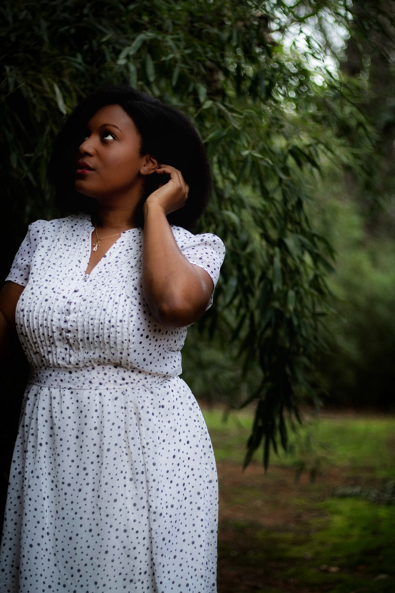
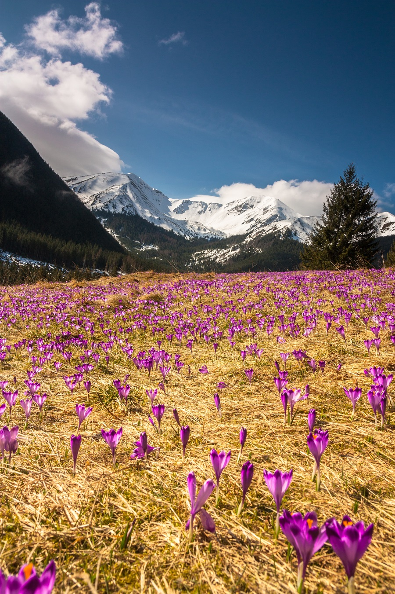
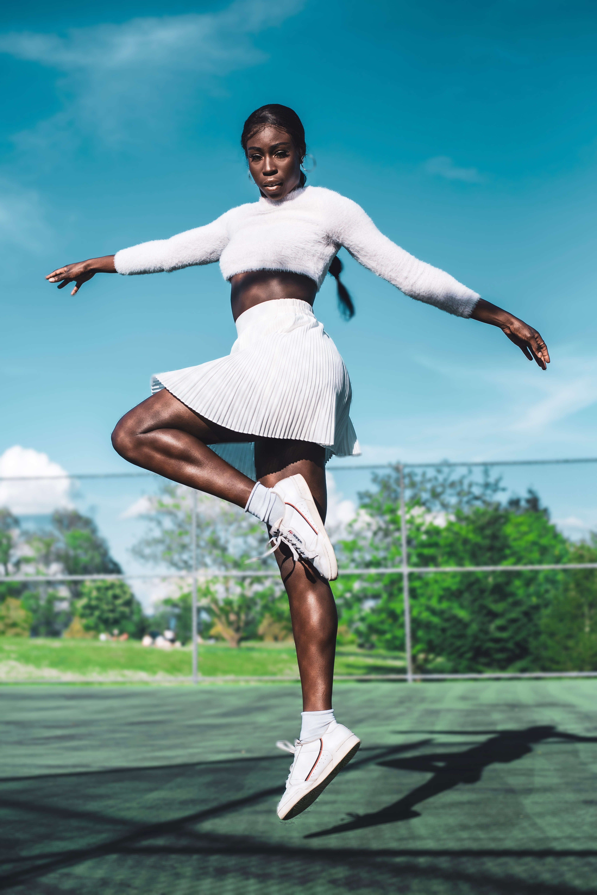
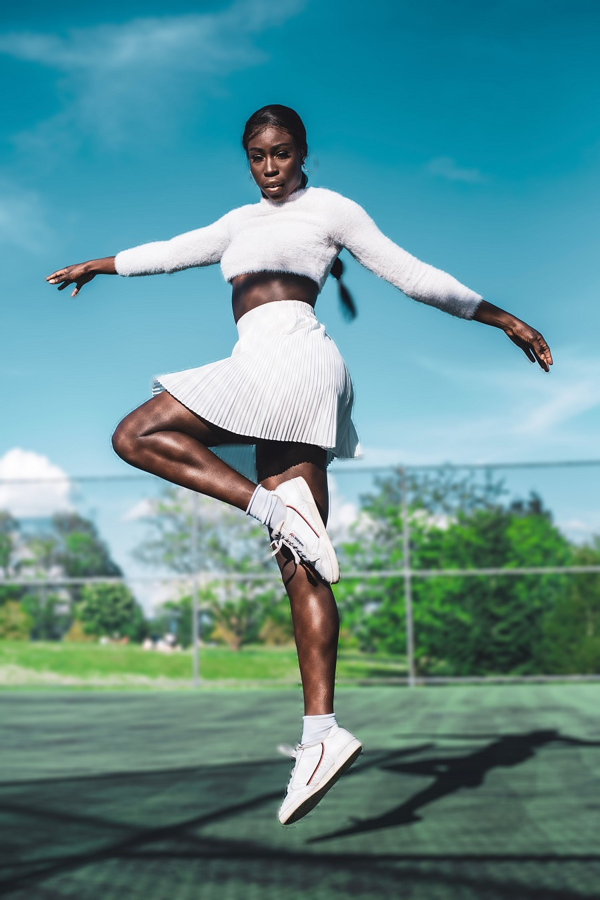
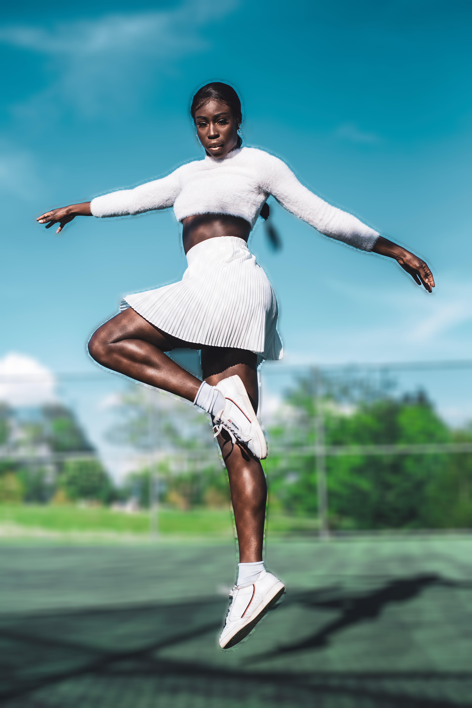

# Image Tuning

Image tuning is the change in the background of an image through image segmentation. The key role of image segmentation is to remove the objects segmented from the image and place it in the new background created. This is done by producing a mask for the image and combining it with the modified background. Deeplabv3+ model trained on pascalvoc dataset is used. The model supports 20 common object categories which means you can change the background of these objects as you desired. The objects are

```
person,bus,car,aeroplane, bicycle, ,motorbike,bird, boat, bottle,  cat, chair, cow, dinningtable, dog, horse pottedplant, sheep, sofa, train, tv

```

Image Tuning features supported are:

* [Change the background of an image with a picture](#Change-the-background-of-an-image-with-a-picture)

* [Assign a distinct color to the background of an image](#Assign-a-distinct-color-to-the-background-of-an-image)

* [Grayscale the background of an image](#Grayscale-the-background-of-an-image)

* [Blur the background of an image](#Blur-the-background-of-an-image)


## Change the background of an image with a picture

**sample.jpg**



**background.jpg**



We intend to change the background of our sample image with this image. We can do this easily with just five lines of code.

``` python
import pixellib
from pixellib.tune_bg import alter_bg


change_bg = alter_bg(model_type = "pb")
change_bg.load_pascalvoc_model("xception_pascalvoc.pb")
change_bg.change_bg_img(f_image_path = "sample.jpg",b_image_path = "background.jpg", output_image_name="new_img.jpg")
```


``` python
import pixellib
from pixellib.tune_bg import alter_bg

change_bg = alter_bg(model_type = "pb")
change_bg.load_pascalvoc_model("xception_pascalvoc.pb")
```
**Line 1-4**: We imported pixellib and from pixellib we imported in the class *alter_bg*. Instance of the class is created and within the class we added a parameter model_type and set it to **pb**. we finally loaded the deeplabv3+ model. PixelLib supports two deeplabv3+ models, keras and tensorflow model. The keras model is extracted from the tensorflow model's checkpoint. The tensorflow model performs better than the keras model extracted from its checkpoint. We will make use of tensorflow model. Download the model from [here](https://github.com/ayoolaolafenwa/PixelLib/releases/download/1.1/xception_pascalvoc.pb).


``` python
change_bg.change_bg_img(f_image_path = "sample.jpg",b_image_path = "background.jpg", output_image_name="new_img.jpg")
```
We called the function *change_bg_img* that handled changing the background of the image with a picture.

It takes the following parameter:

*f_image_path*: This is the foreground image, the image which background would be changed.

*b_image_path*: This is the image that will be used to change the backgroud of the foreground image.

*output_image_name*: The new image with a changed background.

**Output Image**


Wow! We have successfully changed the background of our image.


## Detection of target object

In some applications you may not want to detect all the objects in an image or video, you may just want to target a particular object. By default the model detects all the objects it supports in an image or video. It is possible to filter other objects' detections and detect a target object in an image or video. 


**sample2.jpg**


``` python
change_bg.change_bg_img(f_image_path = "sample2.jpg",b_image_path = "background.jpg", output_image_name="new_img.jpg")
```

**Output Image**


It successfully change the image's background, but our goal is to change the background of the person in this image. We are not comfortable with the other objects showing, this is because car is one the objects supported by the model. Therefore there is need to modify the code to detect a target object.

``` python
import pixellib
from pixellib.tune_bg import alter_bg

change_bg = alter_bg(model_type = "pb")
change_bg.load_pascalvoc_model("xception_pascalvoc.pb")
change_bg.change_bg_img(f_image_path = "sample2.jpg",b_image_path = "background.jpg", output_image_name="new_img.jpg", detect = "person")
```

It is still the same code except we introduced an extra parameter detect in the  function.

```python
change_bg.change_bg_img(f_image_path = "sample2.jpg",b_image_path = "background.jpg", output_image_name="new_img.jpg", detect = "person")
```

The parameter detect is set to *person*.


**Output Image**


This is the new image with only our target object shown. 
If we intend to show only the cars present in this image. We just have to change the value of the parameter person to *car*.

```python
change_bg.change_bg_img(f_image_path = "sample2.jpg",b_image_path = "background.jpg", output_image_name="new_img.jpg", detect = "car")
```

**Output Image**


## Assign a distinct color to the background of an image

You can choose to assign any distinct color to the background of your image. This is also possible with five lines of code.

```python
import pixellib
from pixellib.tune_bg import alter_bg

change_bg = alter_bg(model_type = "pb")
change_bg.load_pascalvoc_model("xception_pascalvoc.pb")
change_bg.color_bg("sample2.jpg", colors = (0,0,255), output_image_name="colored_bg.jpg", detect = "person")
```

It is very similar to the code used above for changing the background of an image with a picture. The only difference is that we replaced the function *change_bg_img* to *color_bg* the function that will handle color change.

``` python
change_bg.color_bg("sample2.jpg", colors = (0, 0, 255), output_image_name="colored_bg.jpg", detect = "person")
```
The function *color_bg* takes the parameter *colors* and we provided the RGB value of the color we want to use. We want the image to have a blue background and the color's RGB value is set to blue which is *(0, 0, 255)*.  

**Colored Image**


## Note:
**You can assign any color to the background of your image, just provide the RGB value of the color.**


## Grayscale the background of an image

``` python
import pixellib
from pixellib.tune_bg import alter_bg

change_bg = alter_bg(model_type = "pb")
change_bg.load_pascalvoc_model("xception_pascalvoc.pb")
change_bg.gray_bg("sample2.jpg",output_image_name="gray_img.jpg", detect = "person")
```

``` python
change_bg.gray_bg("sample.jpg",output_image_name="gray_img.jpg", detect = "person")
```

It is still the same code except we called the function *gray_bg* to grayscale the background of the image.

**Output Image**


## Blur the background of an image

**sample3.jpg**


You can also apply the effect of bluring the background of your image. You can control how blur the background will be.

``` python
change_bg.blur_bg("sample2.jpg", low = True, output_image_name="blur_img.jpg")
```
We called the function *blur_bg* to blur the background of the image and set the blurred effect to be low. There are three parameters that control the degree in which the background is blurred.

*low:* When it is set to true the background is blurred slightly.

*moderate:* When it is set to true the background is moderately blurred.

*extreme:* When it is set to true the background is deeply blurred.

**blur_low**


The image is blurred with a low effect.




``` python
change_bg.blur_bg("sample2.jpg", moderate = True, output_image_name="blur_img.jpg")
```
We want to moderately blur the background of the image, we set *moderate* to *true*.

**blur_moderate**

The image is blurred with a moderate effect.




``` python
change_bg.blur_bg("sample2.jpg", extreme = True, output_image_name="blur_img.jpg")
```
We want to deeply blurred the background of the image and  we set *extreme* to *true*.

**blur_extreme**


The image is blurred with a deep effect.




*Full code*
```python
import pixellib
from pixellib.tune_bg import alter_bg

change_bg = alter_bg(model_type = "pb")
change_bg.load_pascalvoc_model("xception_pascalvoc.pb")
change_bg.blur_bg("sample2.jpg", moderate = True, output_image_name="blur_img.jpg")
```

## Blur a target object in an image

```python
change_bg.blur_bg("sample2.jpg", extreme = True, output_image_name="blur_img.jpg", detect = "person")
```
Our target object is a person.


```python
change_bg.blur_bg("sample2.jpg", extreme = True, output_image_name="blur_img.jpg", detect = "car")
```

Our target object is a car.


## Obtain output arrays

You can obtain the output arrays of your changed image....

*Obtain output array of the changed image array*

``` python
import pixellib
from pixellib.tune_bg import alter_bg
import cv2

change_bg = alter_bg(model_type = "pb")
change_bg.load_pascalvoc_model("xception_pascalvoc.pb")
output = change_bg.change_bg_img(f_image_path = "sample.jpg",b_image_path = "background.jpg", detect = "person")
cv2.imwrite("img.jpg", output)
```

*Obtain output array of the colored image*

```python
import pixellib
from pixellib.tune_bg import alter_bg
import cv2

change_bg = alter_bg(model_type = "pb")
change_bg.load_pascalvoc_model("xception_pascalvoc.pb")
output = change_bg.color_bg("sample.jpg", colors = (0, 0, 255), detect = "person")
cv2.imwrite("img.jpg", output)
```

*Obtain output array of the blurred image*

``` python
import pixellib
from pixellib.tune_bg import alter_bg
import cv2

change_bg = alter_bg(model_type = "pb")
change_bg.load_pascalvoc_model("xception_pascalvoc.pb")
output = change_bg.blur_bg("sample.jpg", moderate = True, detect = "person")
cv2.imwrite("img.jpg", output)
```

*Obtain output array of the grayed image*

``` python
import pixellib
from pixellib.tune_bg import alter_bg
import cv2

change_bg = alter_bg(model_type = "pb")
change_bg.load_pascalvoc_model("xception_pascalvoc.pb")
output = change_bg.gray_bg("sample.jpg", detect = "person")
cv2.imwrite("img.jpg", output)
```

## Process frames directly with Image Tuning...

**Create a virtual background for frames**

```python
import pixellib
from pixellib.tune_bg import alter_bg
import cv2

change_bg = alter_bg(model_type = "pb")
change_bg.load_pascalvoc_model("xception_pascalvoc.pb")

capture = cv2.VideoCapture(0)
while True:
    ret, frame = capture.read()
    output = change_bg.change_frame_bg(frame, "flowers.jpg", detect = "person")
    cv2.imshow("frame", output)
    if  cv2.waitKey(25) & 0xff == ord('q'):
        break
```

**Blur frames**

```python
import pixellib
from pixellib.tune_bg import alter_bg
import cv2

change_bg = alter_bg(model_type = "pb")
change_bg.load_pascalvoc_model("xception_pascalvoc.pb")

capture = cv2.VideoCapture(0)
while True:
    ret, frame = capture.read()
    output = change_bg.blur_frame(frame, extreme = True, detect = "person")
    cv2.imshow("frame", output)
    if  cv2.waitKey(25) & 0xff == ord('q'):
        break
```

**Color frames**

```python
import pixellib
from pixellib.tune_bg import alter_bg
import cv2

change_bg = alter_bg(model_type = "pb")
change_bg.load_pascalvoc_model("xception_pascalvoc.pb")

capture = cv2.VideoCapture(0)
while True:
    ret, frame = capture.read()
    output = change_bg.color_frame(frame, colors = (255, 255, 255), detect = "person")
    cv2.imshow("frame", output)
    if  cv2.waitKey(25) & 0xff == ord('q'):
        break
```

**Grayscale frames**

```python
import pixellib
from pixellib.tune_bg import alter_bg
import cv2

change_bg = alter_bg(model_type = "pb")
change_bg.load_pascalvoc_model("xception_pascalvoc.pb", detect = "person")

capture = cv2.VideoCapture(0)
while True:
    ret, frame = capture.read()
    output = change_bg.gray_frame(frame)
    cv2.imshow("frame", output)
    if  cv2.waitKey(25) & 0xff == ord('q'):
        break
```

Read the [tutorial](change_video_bg.md) on blurring, coloring and grayscaling background of videos and camera's feeds.


