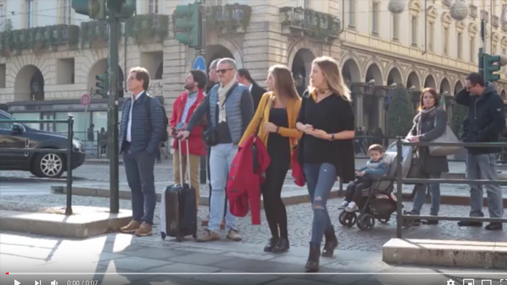
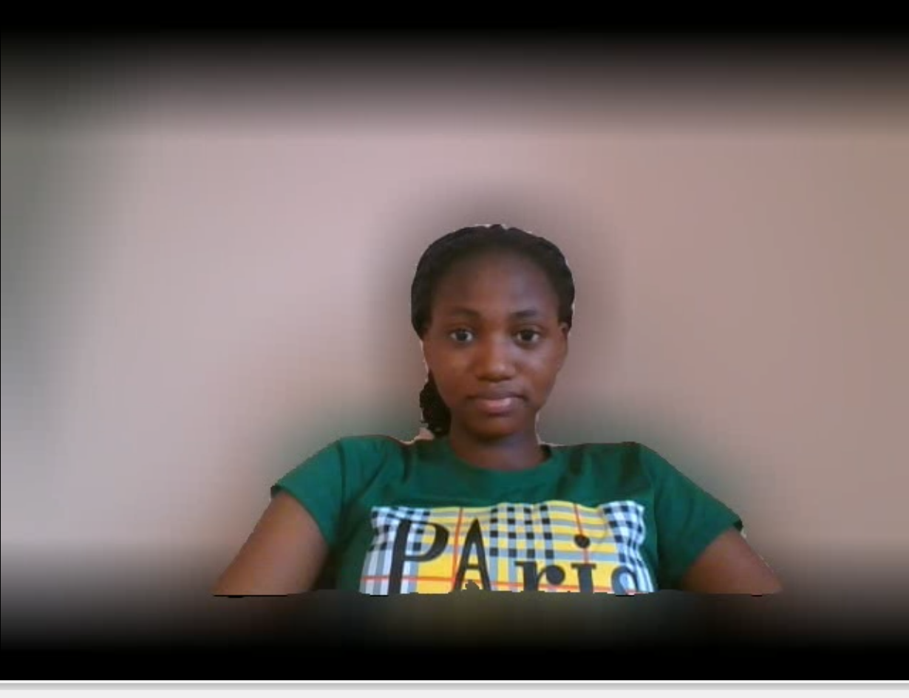
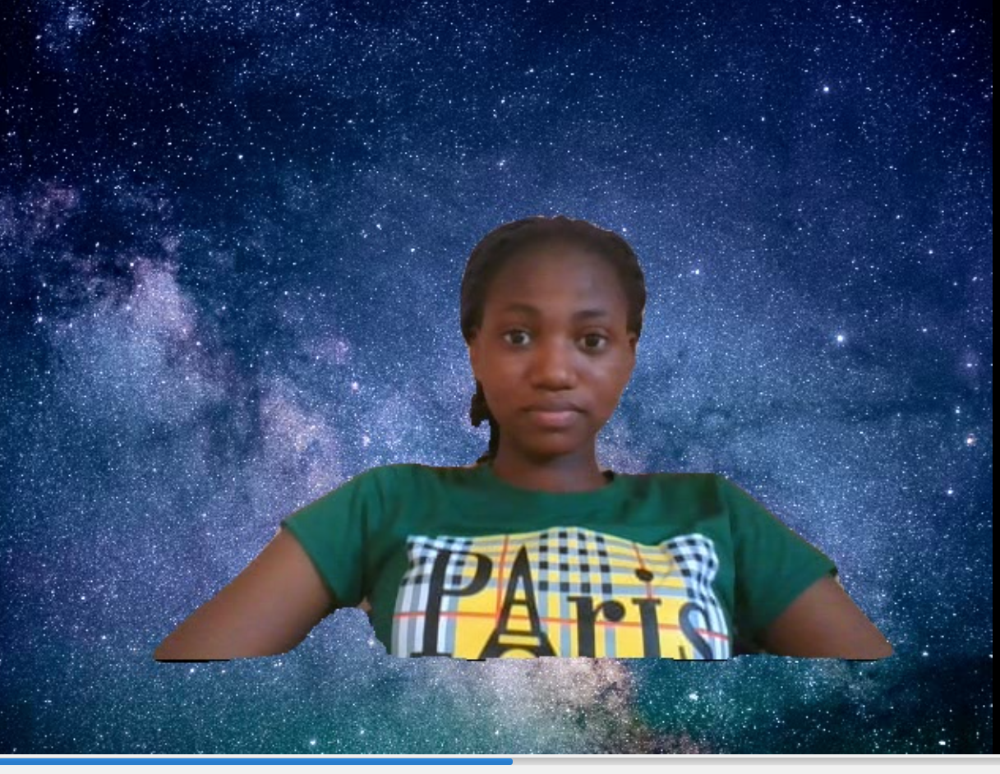
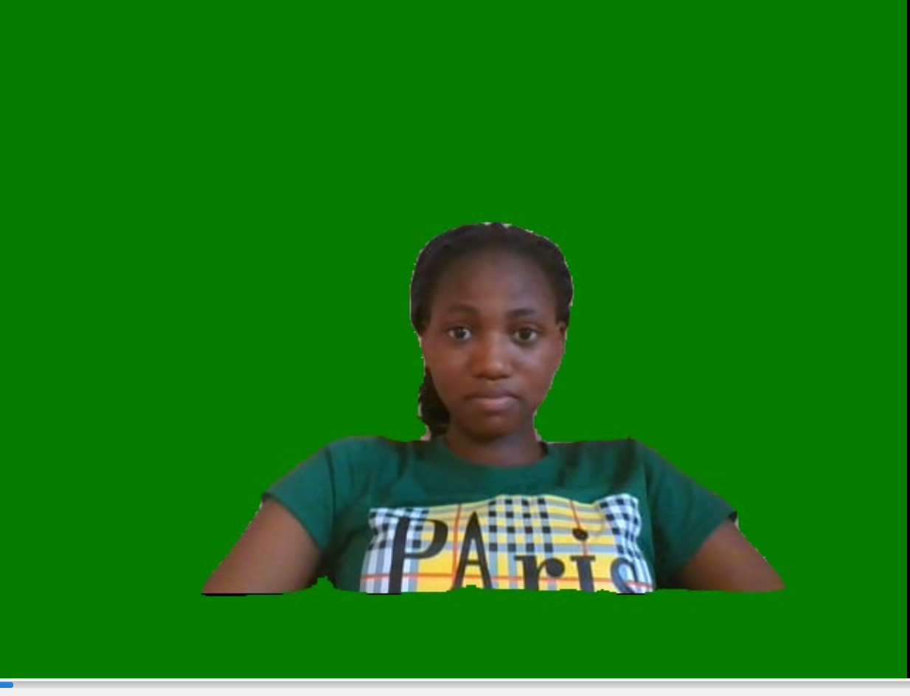
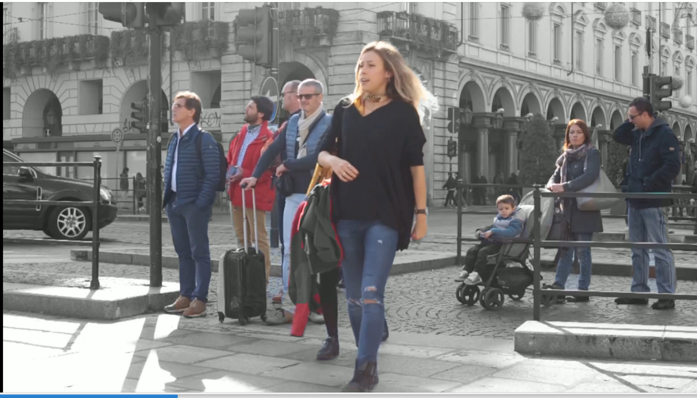

# Alter Video Background

[Blur Video Background](#Blur-Video-Background)

[Blur the Background of Camera's Feeds](#Blur-the-Background-of-Camera's-Feeds)

[Create a Virtual Background for a Video](#Create-a-Virtual-Background-for-a-Video])

[Create a Virtual Background for Camera's Feeds](#Create-a-Virtual-Background-for-Camera-Feeds])

[Color Video Background](#Color-Video-Background)

[Color the Background of Camera's Feeds](#Color-the-Background-of-Camera's-Feeds)

[Grayscale Video Background](#Grayscale-Video-Background)

[Grayscale the Background of Camera's Feeds](#Grayscale-the-Background-of-Camera's-Feeds)


## Blur Video Background

Blur the background of a video with five lines of code.

**sample_video**
[](https://www.youtube.com/watch?v=8fkthbwqmB0)


```python
import pixellib
from pixellib.tune_bg import alter_bg

change_bg = alter_bg(model_type = "pb")
change_bg.load_pascalvoc_model("xception_pascalvoc.pb")
change_bg.blur_video("sample_video.mp4", extreme = True, frames_per_second=10, output_video_name="blur_video.mp4", detect = "person")
```

**Line 1-4**: We imported pixellib and from pixellib we imported in the class *alter_bg*. Instance of the class is created and and within the class we added a parameter model_type and set it to **pb**. we finally loaded the deeplabv3+ model. PixelLib supports two deeplabv3+ models, keras and tensorflow model. The keras model is extracted from the tensorflow model's checkpoint. The tensorflow model performs better than the keras model extracted from its checkpoint. We will make use of tensorflow model. Download the model from [here](https://github.com/ayoolaolafenwa/PixelLib/releases/download/1.1/xception_pascalvoc.pb).


There are three parameters that control the degree in which the background is blurred.

*low:* When it is set to true the background is blurred slightly.

*moderate:* When it is set to true the background is moderately blurred.

*extreme:* When it is set to true the background is deeply blurred.


## Detection of target object

In some applications you may not want to detect all the objects in a video, you may just want to target a particular object. By default the model detects all the objects it supports in an image or video. It is possible to filter other objects' detections and detect a target object in an image or video. 

```python
change_bg.blur_video("sample_video.mp4", extreme = True, frames_per_second=10, output_video_name="blur_video.mp4", detect = "person")
```

This is the line of code that blurs the video's background. This function takes in four parameters:

**video_path:** the path to the video file we want to blur.

**moderate:** it is set to true and the background of the video would be moderatly blurred.

**frames_per_second:** this is the parameter to set the number of frames per second for the output video file. In this case it is set to 10 i.e the saved video file will have 10 frames per second.

**output_video_name:** the saved video. The output video will be saved in your current working directory.

**detect (optional):** this is the parameter that detects a particular object and filters out other detectons. It is set to detect *person* in the video. 

**Output Video**
[](https://youtu.be/duTiKf76ZU8)


## Blur the Background of Camera's Feeds

```python
import pixellib
from pixellib.tune_bg import alter_bg
import cv2

capture = cv2.VideoCapture(0)
change_bg = alter_bg(model_type = "pb")
change_bg.load_pascalvoc_model("xception_pascalvoc.pb")
change_bg.blur_camera(capture, frames_per_second=10,extreme = True, show_frames = True, frame_name = "frame", 
output_video_name="output_video.mp4", detect = "person")
```

```python

  import cv2
  capture = cv2.VideoCapture(0)
```
We imported cv2 and included the code to capture camera frames.

```python

  change_bg.blur_camera(capture, extreme = True, frames_per_second= 10, output_video_name="output_video.mp4", show_frames= True,frame_name= "frame",  detect = "person")  
```

In the code for blurring camera's frames, we replaced the video filepath to capture i.e we are going to process a stream of camera frames instead of a video file.We added extra parameters for the purpose of showing the camera frames:

**show_frames:** this parameter handles showing of segmented camera frames and press q to exit.
**frame_name:** this is the name given to the shown camera's frame.


**Output Video**

[](https://www.youtube.com/watch?v=zBSD0us1oWQ)


A sample video of camera's feeds with my background blurred.


## Create a Virtual Background for a Video

You can make use of any image to create a virtual background for a video.


**sample video**
[](https://www.youtube.com/watch?v=lsox_IZLj7U) 

**Image to serve as background for a video**


```python
import pixellib
from pixellib.tune_bg import alter_bg

change_bg = alter_bg(model_type="pb")
change_bg.load_pascalvoc_model("xception_pascalvoc.pb")
change_bg.change_video_bg("sample_video.mp4", "bg.jpg", frames_per_second = 10, output_video_name="output_video.mp4", detect = "person")
```

```python
change_bg.change_video_bg("sample_video.mp4", "bg.jpg", frames_per_second = 10, output_video_name="output_video.mp4", detect = "person")
```

It is still the same code except we called the function *change_video_bg* to create a virtual background for the video. The function takes in the path of the image we want to use as background for the video. 

**Output Video**

[](https://www.youtube.com/watch?v=699Hyi6oZFs)


## Create a Virtual Background for Camera's Feeds

```python
import pixellib
from pixellib.tune_bg import alter_bg
import cv2

cap = cv2.VideoCapture(0)

change_bg = alter_bg(model_type="pb")
change_bg.load_pascalvoc_model("xception_pascalvoc.pb")
change_bg.change_camera_bg(cap, "bg.jpg", frames_per_second = 10, show_frames=True, frame_name="frame", output_video_name="output_video.mp4", detect = "person")
```

``` python
change_bg.change_camera_bg(cap, "bg.jpg", frames_per_second = 10, show_frames=True, frame_name="frame", output_video_name="output_video.mp4", detect = "person")
```

It is similar to the code we used to blur camera's frames. The only difference is that we called the function *change_bg.change_camera_bg*. We performed the same routine, replaced the video filepath to capture and added the same parameters. 

**Output Video**

[](https://www.youtube.com/watch?v=K3GIdfYyv_g)


PixelLib successfully created a virtual effect on my background. 

## Color Video Background

```python
import pixellib
from pixellib.tune_bg import alter_bg

change_bg = alter_bg(model_type = "pb")
change_bg.load_pascalvoc_model("xception_pascalvoc.pb")
change_bg.color_video("sample_video.mp4", colors =  (0, 128, 0), frames_per_second=10, output_video_name="output_video.mp4", detect = "person")
```

```python
change_bg.color_video("sample_video.mp4", colors =  (0, 128, 0), frames_per_second=10, output_video_name="output_video.mp4", detect = "person")
```

It is still the same code except we called the function *color_video* to give the video's background a distinct color. The function *color_bg* takes the parameter *colors* and we provided the RGB value of the color we want to use. We want the image to have a green background and the color's RGB value is set to green which is (0, 128, 0).    

**Output Video**

[](https://www.youtube.com/watch?v=aA4g7qccczg)


## Color the Background of Camera's Feeds

``` python
import pixellib
from pixellib.tune_bg import alter_bg
import cv2

capture = cv2.VideoCapture(0)
change_bg = alter_bg(model_type = "pb")
change_bg.load_pascalvoc_model("xception_pascalvoc.pb")
change_bg.color_camera(capture, frames_per_second=10,colors = (0, 128, 0), show_frames = True, frame_name = "frame", 
output_video_name="output_video.mp4", detect = "person")
```

``` python
change_bg.color_camera(capture, frames_per_second=10,colors = (0, 128, 0), show_frames = True, frame_name = "frame", 
output_video_name="output_video.mp4", detect = "person")
```

It is similar to the code we used to blur camera's frames. The only difference is that we called the function *color_camera*. We performed the same routine, replaced the video filepath to capture and added the same parameters. 

**Output Video**

[](https://www.youtube.com/watch?v=8TvTNHOMZV0)

A sample video of camera's feeds with my background colored green.


## Grayscale Video Background

``` python
import pixellib
from pixellib.tune_bg import alter_bg

change_bg = alter_bg(model_type = "pb")
change_bg.load_pascalvoc_model("xception_pascalvoc.pb")
change_bg.gray_video("sample_video.mp4", frames_per_second=10, output_video_name="output_video.mp4", detect = "person")
```

``` python
change_bg.gray_video("sample_video.mp4", frames_per_second=10, output_video_name="output_video.mp4", detect = "person")
```

We are still using the same code but called a different function *gray_video* to grayscale the background of the video.


**Output Video**

[](https://www.youtube.com/watch?v=W94S4ST201Q)


## Grayscale the Background of Camera's Feeds

``` python
import pixellib
from pixellib.tune_bg import alter_bg
import cv2

capture = cv2.VideoCapture(0)
change_bg = alter_bg(model_type = "pb")
change_bg.load_pascalvoc_model("xception_pascalvoc.pb")
change_bg.gray_camera(capture, frames_per_second=10, show_frames = True, frame_name = "frame", 
output_video_name="output_video.mp4", detect = "person")
```
It is similar to the code we used to color camera's frames. The only difference is that we called the function *gray_camera*. We performed the same routine, replaced the video filepath to capture and added the same parameters. 


