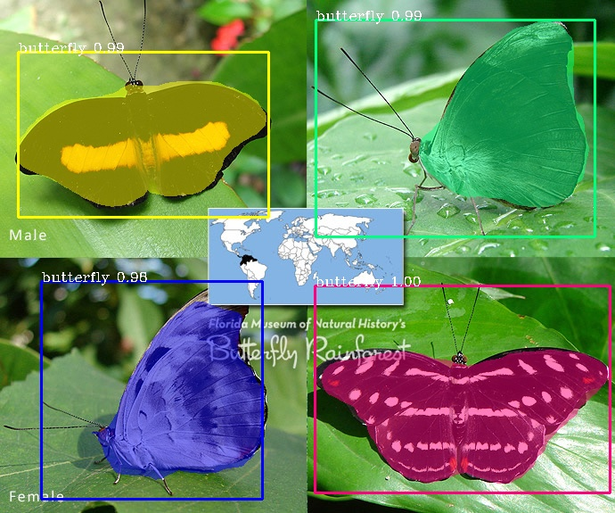
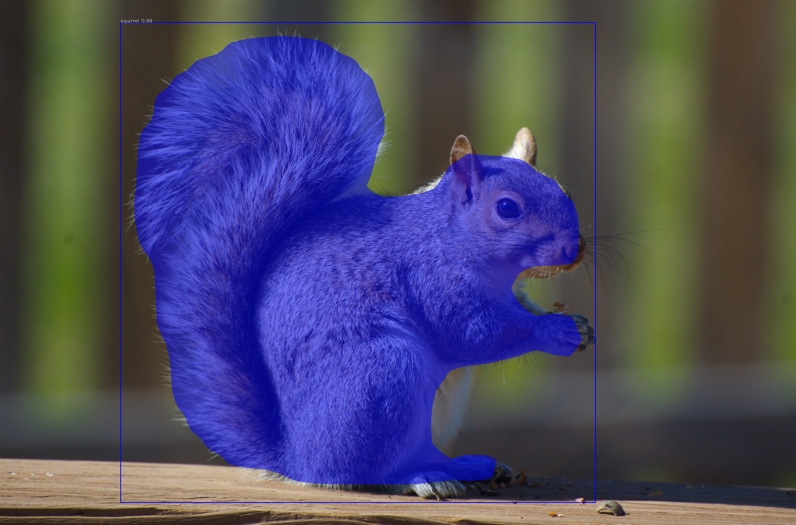
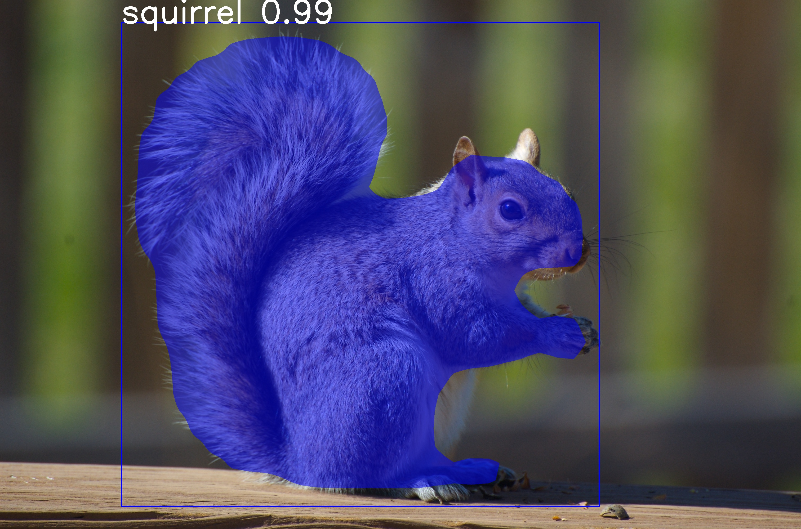
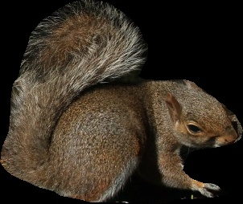
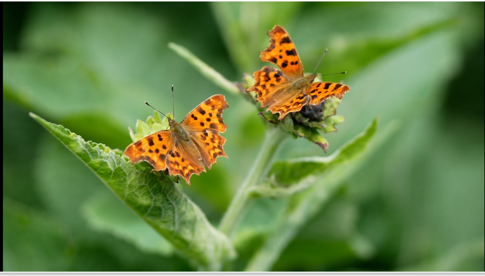
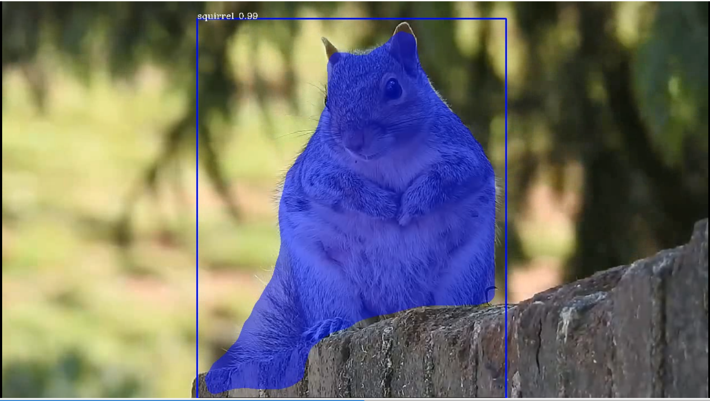
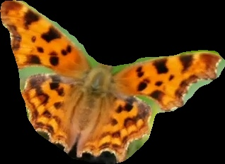

# Inference with a custom model

We have trained and evaluated the model, the next step is to see the performance of the model on unknown images. 
We are going to test the model on the classes we have trained it on. If you are yet to download the nature's model trained on Nature dataset download it from [here](https://github.com/ayoolaolafenwa/PixelLib/releases/download/1.0.0/Nature_model_resnet101.h5)

*sample1.jpg*


```python

   import pixellib
   from pixellib.instance import custom_segmentation

   segment_image = custom_segmentation()
   segment_image.inferConfig(num_classes= 2, class_names= ["BG", "butterfly", "squirrel"])
   segment_image.load_model("mask_rcnn_model/Nature_model_resnet101.h5")
   segment_image.segmentImage("sample1.jpg", show_bboxes=True, output_image_name="sample_out.jpg")
```

```python

   import pixellib
   from pixellib.instance import custom_segmentation 
   segment_image =custom_segmentation()
   segment_image.inferConfig(num_classes= 2, class_names= ["BG", "butterfly", "squirrel"])
```

We imported the class custom_segmentation, the class for performing inference and created an instance of the class. We called the model configuration and introduced an extra parameter class_names.

```
class_names= ["BG", "butterfly", "squirrel"])
```
**class_names:** It is a list containing  the names of classes the model is trained with. "BG", it refers to the background of the image, it is the first class and must be available along the names of the classes.

**Note:** If you have multiple classes and you are confused of how to arrange the classes's names according to their class ids, in your test.json in the dataset's folder check the categories' list.

```
{
"images": [
{
"height": 205,
"width": 246,
"id": 1,
"file_name": "C:\\Users\\olafe\\Documents\\Ayoola\\PIXELLIB\\Final\\Nature\\test\\butterfly (1).png"
},
],
"categories": [
{
"supercategory": "butterfly",
"id": 1,
"name": "butterfly"
},
{
"supercategory": "squirrel",
"id": 2,
"name": "squirrel"
}
],

```


You can observe from the sample of the directory of test.json above, after the images's  list in your test.json is object categories's list, the classes's names are there with their corresponding class ids. Butterfly has the class id 1 and squirrel has the class id 2.Remember the first id "0" is kept in reserve for the background.

```python
  
  segment_image.load_model("mask_rcnn_model/Nature_model_resnet101.h5)

  segment_image.segmentImage("sample1.jpg", show_bboxes=True, output_image_name="sample_out.jpg")
```
The custom model is loaded and we called the function to segment the image.




*sample2.jpg*


```python
  test_maskrcnn.segmentImage("sample2.jpg",show_bboxes = True, output_image_name="sample_out.jpg")
```


## Better Visualization of Output Segmented Images

The default values set for visualizing segmented images are not compatible with all image resolutions. I have made it possible to regulate the parameters that determine the thickness of the bounding boxes, text size and thickness.

**sample image with default parameters**



``` python
import pixellib
from pixellib.instance import custom_segmentation

ins = custom_segmentation()
ins.inferConfig(num_classes=2, class_names=["BG", "butterfly", "squirrel"])
ins.load_model("Nature_model_resnet101.h5")

res, output = ins.segmentImage("sample.jpg", show_bboxes=True, text_size=4, text_thickness=10,
box_thickness= 4,  output_image_name= "output.jpg")

```

**text_size**: The default text size is 0.6 and it is okay with images with low resolutions. It will be small for images with high resolutions.

**text_thickness**: The default text thickness is 0. I increased it to 4 to match the image resolution.

**box_thickness**: The default box thickness is 2 and I changed it to 10 to match the image resolution.

**Note**: **text_thickness** and **box_thickness** parameters' values must always be in integers and do not express their values in floating point numbers. But **text_size** value can be expressed in both integer and floating point numbers.

**sample image with regulated parameters**




*WOW! We have successfully trained a custom model for performing instance segmentation and object detection on butterflies and squirrels.*

## Extraction of Segmented Objects


PixelLib now makes it possible to extract each of the segmented objects in an image and save each of the object extracted as a separate image. This is the modified code below;


``` python

import pixellib
from pixellib.instance import custom_segmentation

segment_image = custom_segmentation()
segment_image.inferConfig(num_classes= 2, class_names= ["BG", "butterfly", "squirrel"])
segment_image.load_model("mask_rcnn_model/Nature_model_resnet101.h5")
segment_image.segmentImage("sample2.jpg", show_bboxes=True, output_image_name="output.jpg",
extract_segmented_objects= True, save_extracted_objects=True) 
```
We introduced new parameters in the *segmentImage* function which are:

**extract_segmented_objects:** This parameter handles the extraction of each of the segmented object in the image. <br>
**save_extracted_objects:** This parameter saves each of the extracted object as a separate image.Each of the object extracted in the image would be save with the name *segmented_object* with the corresponding index number such as *segmented_object_1*.  


These are the objects extracted from the image above. 

<table>
  <tr>
    <td></td>
    <td></td>
    <td></td>
  </tr>
 </table>


## Batch Segmentation of Images
PixelLib makes it possible to perform prediction on multiple images at once. 

**Code for Batch Prediction**
``` python
import pixellib
from pixellib.instance import custom_segmentation

ins = custom_segmentation()
ins.inferConfig(num_classes=2, class_names= ["BG", "butterfly", "squirrel"])
ins.load_model("Nature_model_resnet101.h5")
ins.segmentBatch("input_folder",  show_bboxes=True, output_folder_name = "output_folder")
```

``` python
ins.segmentBatch("input_folder",  show_bboxes=True, output_folder_name = "output_folder")
```
The code for batch image prediction is very similar to the code used for a single image prediction. We replaced the single image prediction function **segmentImage** with the batch image prediction function **segmentBatch**.  The batch function takes the following parameters;

**input_folder**: this is the folder path of the input images.

**output_folder**: this is the folder path of the output segmented images. 
  **Note**: An output image in the output folder path is saved with the same name as its input image in the input folder path.

*sample folder structure*
```
--input_folder
    --test1.jpg
    --test2.jpg
    --test3.jpg

--output_folder 
    --test1.jpg
    --test2.jpg
    --test3.jpg 

```  

**Code for Extraction of Segmented Objects in Batch Prediction**

``` python
import pixellib
from pixellib.instance import custom_segmentation

ins = custom_segmentation()
ins.inferConfig(num_classes=2, class_names= ["BG", "butterfly", "squirrel"])
ins.load_model("Nature_model_resnet101.h5")
ins.segmentBatch("input_folder",  show_bboxes=True, output_folder_name = "output_folder", extract_segmented_objects=True, save_extracted_objects=True)
```
The extracted objects of each image in the input folder will be saved in a separate folder which will have the name 
**imagename_extracts** e.g if the image name is test1.jpg this means that the extracted objects will be saved in a folder named 
**test1_extracts**. 

**Note**: The folders for the extracted objects are created within the same input folder of the images.
*Sample folder structure* 
```
--input_folder
    --test1.jpg
    --test1_extracts 

    --test2.jpg
    --test2_extracts 

    --test3.jpg
    --test3_extracts

--output_folder   
    --test1.jpg
    --test2.jpg
    --test3.jpg
```


**Specialised uses of PixelLib may require you to return the array of the segmentation's output.**

**Obtain the following arrays**:

-Detected Objects' arrays

-Objects' corresponding class_ids' arrays

-Segmentation masks' arrays

-Output's array

By using this code

``` python

  segmask, output = segment_image.segmentImage()

```


* You can test the code for obtaining arrays and print out the shape of the output by modifying the instance segmentation code below.

``` python

  import pixellib
  from pixellib.instance import custom_segmentation

  segment_image = custom_segmentation()
  segment_image.inferConfig(num_classes= 2, class_names= ["BG", "butterfly", "squirrel"])
  segment_image.load_model("mask_rcnn_model/Nature_model_resnet101.h5")
  segmask, output = segment_image.segmentImage("sample2.jpg")
  cv2.imwrite("img.jpg", output)
  print(output.shape)
```

Obtain arrays of segmentation with bounding boxes by including the parameter **show_bboxes**.

```python

  segmask, output = segment_image.segmentImage(show_bboxes = True)

```


* Full code

```python

  import pixellib
  from pixellib.instance import custom_segmentation

  segment_image = custom_segmentation()
  segment_image.inferConfig(num_classes= 2, class_names= ["BG", "butterfly", "squirrel"])
  segment_image.load_model("mask_rcnn_model/Nature_model_resnet101.h5")
  segmask, output = segment_image.segmentImage("sample2.jpg", show_bboxes= True)
  cv2.imwrite("img.jpg", output)
  print(output.shape)

``` 

**Note:**
Access mask's values  using **segmask['masks']**, bounding box coordinates using **segmask['rois']**, class ids using 
**segmask['class_ids']**.  

``` python
segmask, output = segment_image.segmentImage(show_bboxes = True, extract_segmented_objects= True )
```
Access the value of the extracted and croped segmented object using **segmask['extracted_objects']**


# Video segmentation with a custom model.

*sample_video1*

We want to perform segmentation on the butterflies in this video.

[](https://www.youtube.com/watch?v=5-QWJH0U4cA)

```python
  
  import pixellib
  from pixellib.instance import custom_segmentation

  test_video = custom_segmentation()
  test_video.inferConfig(num_classes=  2, class_names=["BG", "butterfly", "squirrel"])
  test_video.load_model("Nature_model_resnet101")
  test_video.process_video("sample_video1.mp4", show_bboxes = True,  output_video_name="video_out.mp4", frames_per_second=15)
```

```python

  test_video.process_video("video.mp4", show_bboxes = True,  output_video_name="video_out.mp4", frames_per_second=15)
```
The function process_video is called to perform segmentation on objects in a video. 

It takes the following parameters:-

*video_path:* this is the path to the video file we want to segment.

*frames_per_second:*  this is the parameter used to set the number of frames per second for the saved video file. In this case it is set to 15 i.e the saved video file will have 15 frames per second.

*output_video_name:* this is the name of the saved segmented video. The output video will be saved in your current working directory.

*Output_video*

[](https://www.youtube.com/watch?v=bWQGxaZIPOo)


A sample of another segmented video with our custom model.

[](https://www.youtube.com/watch?v=VUnI9hefAQQ&t=2s)


## Extraction of Segmented Objects in Videos

```python
segment_video.process_video("sample.mp4", show_bboxes=True,  extract_segmented_objects=True,save_extracted_objects=True, frames_per_second= 5,  output_video_name="output.mp4")
```

It still the same code except we  introduced new parameters in the *process_video* which are:

**extract_segmented_objects**: this is the parameter that tells the function to extract the objects segmented in the image. It is set to true.

**save_extracted_objects**: this is an optional parameter for saving the extracted segmented objects.

## Extracted objects from the video
<table>
  <tr>
    <td></td>
    <td></td>
  </tr>
 </table>


You can perform live camera segmentation with your custom model making use of this code:

```python

  import pixellib
  from pixellib.instance import custom_segmentation
  import cv2


  capture = cv2.VideoCapture(0)

  segment_camera = custom_segmentation()
  segment_camera.inferConfig(num_classes=2, class_names=["BG", "butterfly", "squirrel"])
  segment_camera.load_model("Nature_model_resnet101.h5")
  segment_camera.process_camera(capture, frames_per_second= 10, output_video_name="output_video.mp4", show_frames= True,
  frame_name= "frame")
```

You will replace the process_video funtion with process_camera function.In the function, we replaced the video's filepath to capture i.e we are processing a stream of frames captured by the camera instead of a video file. We added extra parameters for the purpose of showing the camera frames:

**show_frames:** this parameter handles the showing of segmented camera's frames.

**frame_name:** this is the name given to the shown camera's frame.


## Full code for object extraction in camera feeds Using A Custom Model

```python
import pixellib
from pixellib.instance import custom_segmentation
import cv2

capture = cv2.VideoCapture(0)
segment_frame = custom_segmentation()
segment_frame.inferConfig(num_classes=2, class_names=['BG', 'butterfly', 'squirrel'])
segment_frame.load_model("Nature_model_resnet101.h5")
segment_frame.process_camera(capture, show_bboxes=True, show_frames=True, extract_segmented_objects=True,
save_extracted_objects=True,frame_name="frame", frames_per_second=5, output_video_name="output.mp4")
```


# Process opencv's frames 

```python

  import pixellib
  from pixellib.instance import custom_segmentation
  import cv2

  segment_frame = custom_segmentation()
  segment_frame.inferConfig(network_backbone="resnet101", num_classes=2, class_names=["BG", "butterfly", "squirrel"])
  segment_frame.load_model("Nature_model_resnet101.h5")

  capture = cv2.VideoCapture(0)
   while True:
     ret, frame = capture.read()
     segment_frame.segmentFrame(frame)
     cv2.imshow("frame", frame)
     if  cv2.waitKey(25) & 0xff == ord('q'):
        break  
```