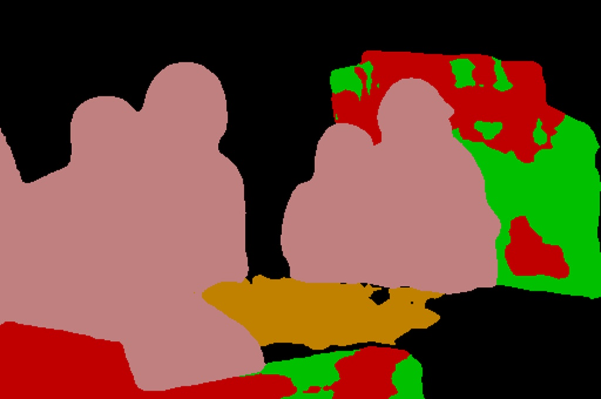
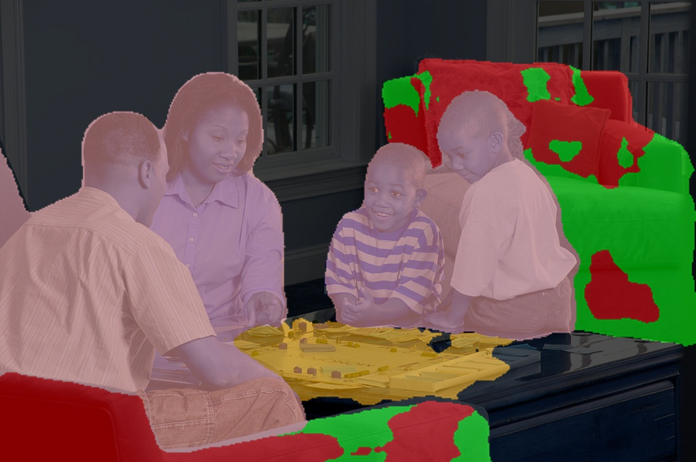

# Semantic segmentation of images with PixelLib using Pascalvoc model

PixelLib is implemented with Deeplabv3+ framework to perform semantic segmentation. Xception model trained on pascalvoc dataset is used for semantic segmentation.

Download the xception model from [here](https://github.com/ayoolaolafenwa/PixelLib/releases/download/1.1/deeplabv3_xception_tf_dim_ordering_tf_kernels.h5>)

# Code to implement semantic segmentation:

```python

import pixellib
from pixellib.semantic import semantic_segmentation

segment_image = semantic_segmentation()
segment_image.load_pascalvoc_model("deeplabv3_xception_tf_dim_ordering_tf_kernels.h5") 
segment_image.segmentAsPascalvoc("path_to_image", output_image_name = "path_to_output_image")
```

We shall take a look into each line of code.


```python

  import pixellib
  from pixellib.semantic import semantic_segmentation

  #created an instance of semantic segmentation class
  segment_image = semantic_segmentation()

```
The class for performing semantic segmentation is imported from pixellib and we created an instance of the class.

```python

  segment_image.load_pascalvoc_model("deeplabv3_xception_tf_dim_ordering_tf_kernels.h5") 
```

We called the function to load the xception model trained on pascal voc. 

```python

  segment_image.segmentAsPascalvoc("path_to_image", output_image_name = "path_to_output_image")
```

This is the line of code that performs segmentation on an image and the segmentation is done in the pascalvoc's color format. This function takes in two parameters:

  **path_to_image**: the path to the image to be segemented.

  **path_to_output_image**: the path to save the output image. The image will be saved in your current working directory.

**Sample1.jpg**  


```python

import pixellib
from pixellib.semantic import semantic_segmentation

segment_image = semantic_segmentation()
segment_image.load_pascalvoc_model("deeplabv3_xception_tf_dim_ordering_tf_kernels.h5") 
segment_image.segmentAsPascalvoc("sample1.jpg", output_image_name = "image_new.jpg")
```



Your saved image with all the objects present segmented.

You can obtain an image with segmentation overlay on the objects with a modified code below.

```python

  segment_image.segmentAsPascalvoc("sample1.jpg", output_image_name = "image_new.jpg", overlay = True)
```
We added an extra parameter **overlay** and set it to **true**, we produced an image with segmentation overlay.




**Specialised uses of PixelLib may require you to return the array of the segmentation's output.**

* Obtain the array of the segmentation's output by using this code, 

```python
segvalues, output = segment_image.segmentAsPascalvoc()
```
* You can test the code for obtaining arrays and print out the shape of the output by modifying the semantic segmentation code below.

```python
  
  import pixellib
  from pixellib.semantic import semantic_segmentation
  import cv2

  segment_image = semantic_segmentation()
  segment_image.load_pascalvoc_model("deeplabv3_xception_tf_dim_ordering_tf_kernels.h5")
  segvalues, output = segment_image.segmentAsPascalvoc("sample1.jpg")
  cv2.imwrite("img.jpg", output)
  print(output.shape)
```


**Note:** Access the *masks* of the objects segmented using **segvalues["masks"]** and their *class ids* using **segvalues["class_ids"]**. 

* Obtain both the segmap and the segmentation overlay's arrays by using this code,

```python

  segvalues, segoverlay = segment_image.segmentAsPascalvoc(overlay = True)

```
```python
  
  import pixellib
  from pixellib.semantic import semantic_segmentation
  import cv2

  segment_image = semantic_segmentation()
  segment_image.load_pascalvoc_model("deeplabv3_xception_tf_dim_ordering_tf_kernels.h5")
  segvalues, segoverlay = segment_image.segmentAsPascalvoc("sample1.jpg", overlay= True)
  cv2.imwrite("img.jpg", segoverlay)
  print(segoverlay.shape)
```
This xception model is trained on pascal voc dataset, a dataset with 20 object categories.

Objects and their corresponding colormaps.


# Process opencv's frames 

```python

  import pixellib
  from pixellib.semantic import semantic_segmentation
  import cv2

  segment_frame = semantic_segmentation()
  segment_frame.load_pascalvoc_model("deeplabv3_xception_tf_dim_ordering_tf_kernels.h5")

  capture = cv2.VideoCapture(0)
  while True:
    ret, frame = capture.read()
    segmap, output = segment_frame.segmentFrameAsPascalvoc(frame)
    cv2.imshow("frame", output)
    if  cv2.waitKey(25) & 0xff == ord('q'):
        break

``` 


