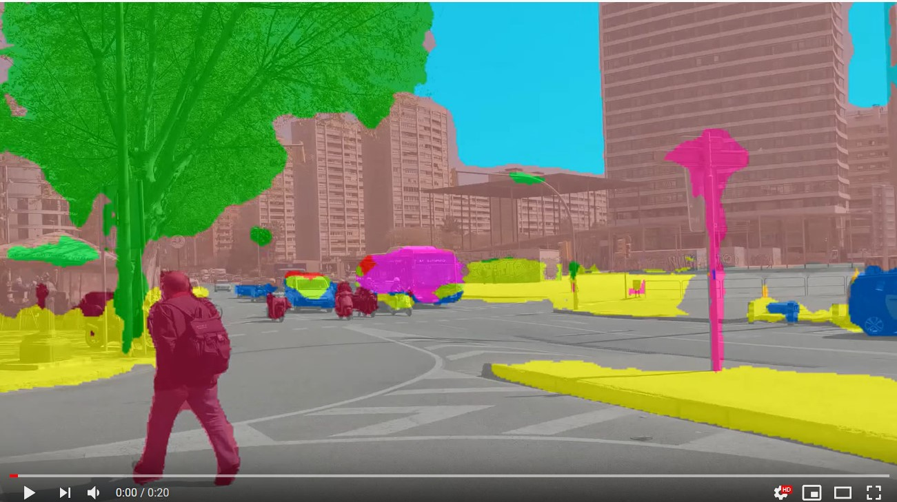
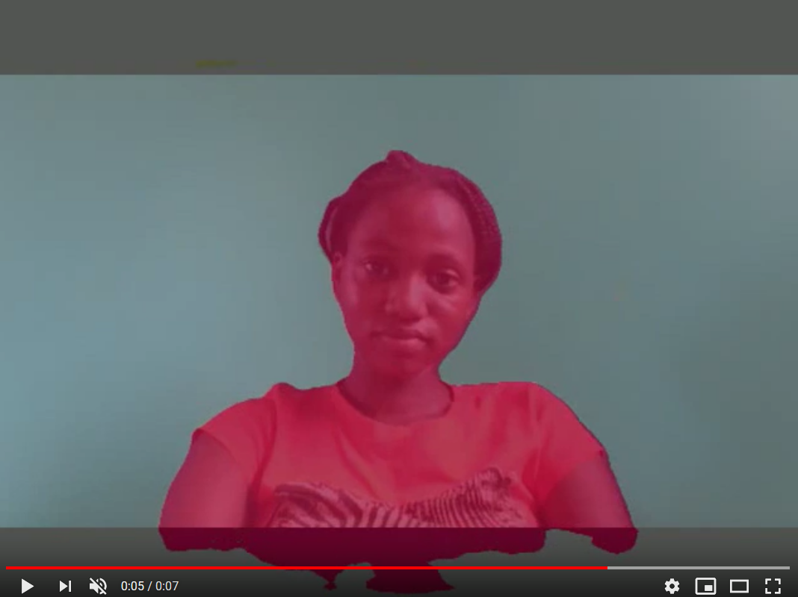

# Semantic segmentation of videos with PixelLib using Ade20k model

PixelLib is implemented with Deeplabv3+ framework to perform semantic segmentation. Xception model trained on ade20k dataset is used for semantic segmentation.

Download the xception model from [here](https://github.com/ayoolaolafenwa/PixelLib/releases/download/1.3/deeplabv3_xception65_ade20k.h5)

**Code to implement semantic segmentation of a video with ade20k model**:

```python

  import pixellib
  from pixellib.semantic import semantic_segmentation

  segment_video = semantic_segmentation()
  segment_video.load_ade20k_model("deeplabv3_xception65_ade20k.h5")
  segment_video.process_video_ade20k("video_path", frames_per_second= 15, output_video_name="path_to_output_video")  
```
We shall take a look into each line of code.


```python

  import pixellib
  from pixellib.semantic import semantic_segmentation

  #created an instance of semantic segmentation class
  segment_image = semantic_segmentation()
```
The class for performing semantic segmentation is imported from pixellib and we created an instance of the class.

```python

  segment_video.load_ade20k_model("deeplabv3_xception65_ade20k.h5")
```  

We called the function to load the xception model trained on ade20k. 

```python

  segment_video.process_video_ade20k("video_path", frames_per_second= 15, output_video_name="path_to_output_video")  
```

This is the line of code that performs segmentation on the video and the segmentation is done in the ade20k's color format. This function takes in two parameters:

**video_path:** the path to the video file we want to perform segmentation on.

**frames_per_second:** this is parameter to set the number of frames per second for the output video file. In this case it is set to 15 i.e the saved video file will have 15 frames per second.

**output_video_name:** the saved segmented video. The output video will be saved in your current working directory.

**sample_video**  

[](https://www.youtube.com/watch?v=EivIBccZURA)


```python

  import pixellib
  from pixellib.semantic import semantic_segmentation

  segment_video = semantic_segmentation()
  segment_video.load_ade20k_model("deeplabv3_xception65_ade20k.h5")
  segment_video.process_video_ade20k("sample_video.mp4", overlay = True, frames_per_second= 15, output_video_name="output_video.mp4")  
```
  

**Output video**

[](https://www.youtube.com/watch?v=hxczTe9U8jY)


# Segmentation of live camera

We can use the same model to perform semantic segmentation on camera. This can be done by few modifications to the code to process video file.

```python

  import pixellib
  from pixellib.semantic import semantic_segmentation
  import cv2


  capture = cv2.VideoCapture(0)

  segment_video = semantic_segmentation()
  segment_video.load_ade20k_model("deeplabv3_xception65_ade20k.h5")
  segment_video.process_camera_ade20k(capture, overlay=True, frames_per_second= 10, output_video_name="output_video.mp4", show_frames= True,frame_name= "frame")
```
```python

  import cv2
  capture = cv2.VideoCapture(0)
```
We imported cv2 and included the code to capture camera frames.

```python

  segment_video.process_camera_ade20k(capture,  overlay = True, frames_per_second= 15, output_video_name="output_video.mp4", show_frames= True,frame_name= "frame")  
```

In the code for performing segmentation, we replaced the video filepath to capture i.e we are going to process a stream camera frames instead of a video file.We added extra parameters for the purpose of showing the camera frames:

**show_frames:** this parameter handles showing of segmented camera frames and press q to exit.
**frame_name:** this is the name given to the shown camera's frame.


A demo by me showing the output of pixelLib's semantic segmentation on camera's feeds using ade20k model.

[](https://www.youtube.com/watch?v=lOaFJpgCMB4&list=PLtFkVrcr8LqNgbwdOb6of5X19ytm4ycHC&index=4)

