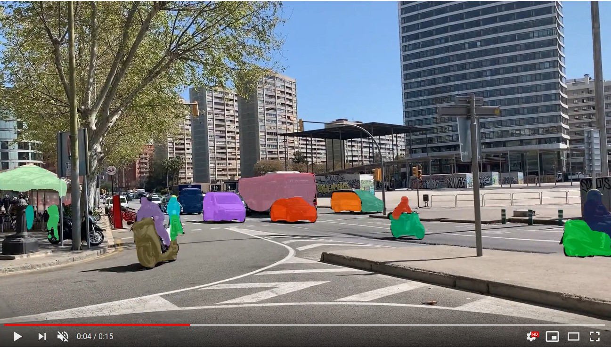

# Instance segmentation of videos with PixelLib

Instance segmentation with PixelLib is based on MaskRCNN framework.

Download the mask rcnn model from [here](https://github.com/ayoolaolafenwa/PixelLib/releases/download/1.2/mask_rcnn_coco.h5)

**Code to implement instance segmentation of videos**


```python

  import pixellib
  from pixellib.instance import instance_segmentation

  segment_video = instance_segmentation()
  segment_video.load_model("mask_rcnn_coco.h5")
  segment_video.process_video("video_path", frames_per_second= 20, output_video_name="path_to_outputvideo")

```
```python

  import pixellib
  from pixellib.instance 

  segment_video = instance_segmentation()
```

We imported in the class for performing instance segmentation and created an instance of the class.

```python
  
  segment_video.load_model("mask_rcnn_coco.h5")
```

We loaded the maskrcnn model trained on coco dataset to perform instance segmentation and it can be downloaded from here.

```python

  segment_video.process_video("sample_video2.mp4", frames_per_second = 20, output_video_name = "output_video.mp4")
```
We called the function  to perform segmentation on the video file.

It takes the following parameters:-

**video_path:** the path to the video file we want to perform segmentation on.

**frames_per_second:** this is parameter to set the number.of frames per second for the output video file. In this case it is set to 15 i.e the saved video file will have 15 frames per second.

**output_video_name:** the saved segmented video. The output video will be saved in your current working directory.  

**Sample video**
[](https://www.youtube.com/watch?v=EivIBccZURA)


```python

  import pixellib
  from pixellib.instance import instance_segmentation

  segment_video = instance_segmentation()
  segment_video.load_model("mask_rcnn_coco.h5")
  segment_video.process_video("sample_video.mp4", frames_per_second= 15, output_video_name="output_video.mp4")
```
**Output video**

[](https://www.youtube.com/watch?v=yu03363mlNM)


We can perform instance segmentation with object detection by setting the parameter *show_bboxes* to true.


```python

  import pixellib
  from pixellib.instance import instance_segmentation

  segment_video = instance_segmentation()
  segment_video.load_model("mask_rcnn_coco.h5")
  segment_video.process_video("sample_video2.mp4", show_bboxes = True, frames_per_second= 15, output_video_name="output_video.mp4")
```


**Output video with bounding boxes**


[](https://www.youtube.com/watch?v=bGPO1bCZLAo)


# Instance Segmentation of Live Camera.

We can use the same model to perform semantic segmentation on camera. This can be done by few modifications to the code used to process video file.

```python

  import pixellib
  from pixellib.instance import instance_segmentation
  import cv2


  capture = cv2.VideoCapture(0)

  segment_video = instance_segmentation()
  segment_video.load_model("mask_rcnn_coco.h5")
  segment_video.process_camera(capture, frames_per_second= 10, output_video_name="output_video.mp4", show_frames= True,
  frame_name= "frame")
```

```python

  import cv2 
  capture = cv2.VideoCapture(0)
```

We imported cv2 and included the code to capture camera frames.

```python

  segment_video.process_camera(capture, show_bboxes = True, frames_per_second = 15, output_video_name = "output_video.mp4", show_frames = True, frame_name = "frame")  
```

In the code for performing segmentation, we replaced the video filepath to capture i.e we are going to process a stream camera frames instead of a video file.We added extra parameters for the purpose of showing the camera frames.
  
**show_frames** this parameter handles showing of segmented camera frames and press q to exist.

**frame_name** this is the name given to the shown camera's frame.


A demo by me showing the output of pixelLib's instance segmentation on camera's feeds using MASK-RCNN model.

[](https://www.youtube.com/watch?v=HD1m-g7cOKw)

## Speed Adjustments for Faster Inference
PixelLib now supports the ability to adjust the speed of detection according to a user's needs. The inference speed with a minimal reduction in the accuracy of detection. There are three main parameters that control the speed of detection.

**average**
**fast**
**rapid**

By default the detection speed is about 1 second for a processing a single image using Nvidia GeForce 1650.
**Using Average Detection   Mode**
```python
  import pixellib
  from pixellib.instance import instance_segmentation
  import cv2


  capture = cv2.VideoCapture(0)

  segment_video = instance_segmentation(infer_speed = "average")
  segment_video.load_model("mask_rcnn_coco.h5")
  segment_video.process_camera(capture, frames_per_second= 10, output_video_name="output_video.mp4", show_frames= True,
  frame_name= "frame")
```
In the modified code above within the class *instance_segmentation* we introduced a new parameter **infer_speed** which determines the speed of detection and it was set to **average**. The average value reduces the detection to half of its original speed, the detection speed would become *0.5* seconds for processing a single image.


**Using fast Detection  Mode**
```python

  
  import pixellib
  from pixellib.instance import instance_segmentation
  import cv2


  capture = cv2.VideoCapture(0)

  segment_video = instance_segmentation(infer_speed = "fast")
  segment_video.load_model("mask_rcnn_coco.h5")
  segment_video.process_camera(capture, frames_per_second= 10, output_video_name="output_video.mp4", show_frames= True,
  frame_name= "frame")
```
In the code above we replaced the **infer_speed**  value to **fast** and the speed of detection is about *0.35* seconds for processing a single image.

**Using rapid Detection Mode**
```python

  
  import pixellib
  from pixellib.instance import instance_segmentation
  import cv2


  capture = cv2.VideoCapture(0)

  segment_video = instance_segmentation(infer_speed = "rapid")
  segment_video.load_model("mask_rcnn_coco.h5")
  segment_video.process_camera(capture, frames_per_second= 10, output_video_name="output_video.mp4", show_frames= True,
  frame_name= "frame")
```
In the code above we replaced the **infer_speed**  value to **rapid** the fastest the detection mode. The speed of detection  becomes 
*0.25* seconds for processing a single image. 
The rapid detection speed mode achieves 4fps.

