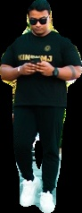
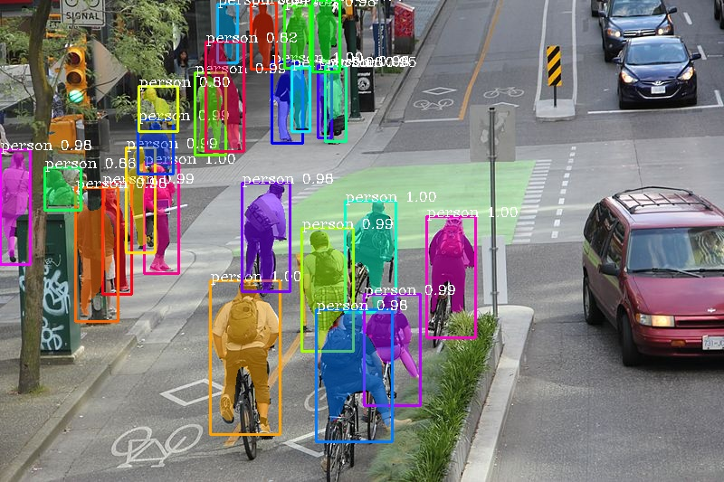
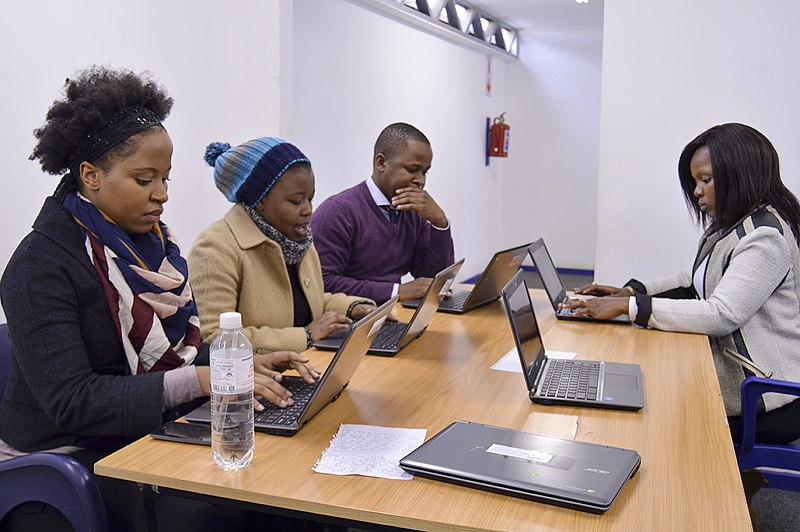

.. _image_instance:

**Instance segmentation of images with PixelLib**
==================================================

Instance segmentation with PixelLib is based on MaskRCNN framework.

Download the mask rcnn model from `here <https://github.com/ayoolaolafenwa/PixelLib/releases/download/1.2/mask_rcnn_coco.h5>`_

*Code to implement instance segmentation*:

.. code-block:: python

  import pixellib
  from pixellib.instance import instance_segmentation

  segment_image = instance_segmentation()
  segment_image.load_model("mask_rcnn_coco.h5") 
  segment_image.segmentImage("path_to_image", output_image_name = "output_image_path")

*Observing each line of code:*

.. code-block:: python

  import pixellib
  from pixellib.instance import instance_segmentation

  segment_image = instance_segmentation()

The class for performing instance segmentation is imported and we created an instance of the class.

.. code-block:: python

  segment_image.load_model("mask_rcnn_coco.h5") 

This is the code to load the mask rcnn model to perform instance segmentation. 

.. code-block:: python

  segment_image.segmentImage("path_to_image", output_image_name = "output_image_path")

This is the code to perform instance segmentation on an image and it takes two parameters:

  *path_to_image*: The path to the image to be predicted by the model.

  *output_image_name*: The path to save the segmentation result. It will be saved in your current working directory.

**Sample2.jpg**

.. image:: photos/sample2.jpg  

Image's source:Wikicommons

.. code-block:: python

  import pixellib
  from pixellib.instance import instance_segmentation

  segment_image = instance_segmentation()
  segment_image.load_model("mask_rcnn_coco.h5") 
  segment_image.segmentImage("sample2.jpg", output_image_name = "image_new.jpg")

.. image:: photos/masks.jpg  

This is the saved image in your current working directory. 

You can implement segmentation with bounding boxes. This can be achieved by modifying the code.

.. code-block:: python

  segment_image.segmentImage("sample2.jpg", output_image_name = "image_new.jpg", show_bboxes = True)

We added an extra parameter **show_bboxes** and set it to **true**, the segmentation masks are produced with bounding boxes.

.. image:: photos/maskboxes.jpg

You get a saved image with both segmentation masks and bounding boxes.

**Extraction of Segmented Objects**

PixelLib now makes it possible to extract each of the segmented objects in an image and save each of the object extracted as a separate image. This is the modified code below;

.. image:: photos/image.jpg

.. code-block:: python

  import pixellib
  from pixellib.instance import instance_segmentation

  seg = instance_segmentation()
  seg.load_model("mask_rcnn_coco.h5")
  seg.segmentImage("sample2.jpg", show_bboxes=True, output_image_name="output.jpg",
  extract_segmented_objects= True, save_extracted_objects=True) 
 
We introduced new parameters in the *segmentImage* function which are:

*extract_segmented_objects:* This parameter handles the extraction of each of the segmented object in the image. 

*save_extracted_objects:* This parameter saves each of the extracted object as a separate image.Each of the object extracted in the image would be save with the name *segmented_object* with the corresponding index number such as *segmented_object_1*.  

These are the objects extracted from the image above. 

.. image:: photos/e1.jpg 

   
  
**Detection of Target Classes**

The pre-trained coco model used detects 80 classes of objects. PixelLib has made it possible to filter out unused detections and detect the classes you want.

**Code to detect target classes**

.. code-block:: python
 
  import pixellib
  from pixellib.instance import instance_segmentation

  seg = instance_segmentation()
  seg.load_model("mask_rcnn_coco.h5")
  target_classes = seg.select_target_classes(person=True)
  seg.segmentImage("sample2.jpg", segment_target_classes= target_classes, show_bboxes=True,  output_image_name="a.jpg") 

.. code-block:: python
   
  target_classes = seg.select_target_classes(person=True)
  seg.segmentImage("sample2.jpg", segment_target_classes= target_classes, show_bboxes=True,  output_image_name="a.jpg") 

We introduced a new function *select_target_classes* that determines the target class to be detected. In this case we want to detect only *person* in the image. In the function *segmentImage* we added a new parameter *segment_target_classes* to filter unused detections and detect only the target class.

Beautiful Result! We were able to filter other detections and detect only the people in the image.

**Speed Adjustments for Faster Inference**

PixelLib now supports the ability to adjust the speed of detection according to a user's needs. The inference speed with a minimal reduction in the accuracy of detection. There are three main parameters that control the speed of detection.

1 **average**

2 **fast**

3 **rapid**

By default the detection speed is about 1 second for a processing a single image.

**average detection mode**

.. code-block:: python

  import pixellib
  from pixellib.instance import instance_segmentation

  segment_image = instance_segmentation(infer_speed = "average" )
  segment_image.load_model("mask_rcnn_coco.h5") 
  segment_image.segmentImage("sample.jpg", show_bboxes = True, output_image_name = "new.jpg")

In the modified code above within the class *instance_segmentation* we introduced a new parameter **infer_speed** which determines the speed of detection and it was set to **average**. The average value reduces the detection to half of its original speed, the detection speed would become *0.5* seconds for processing a single image.

**Output Image** 

.. image:: photos/average.jpg

We obtained beautiful results with *average detection speed mode*. 

**fast detection  mode**

.. code-block:: python

  import pixellib
  from pixellib.instance import instance_segmentation

  segment_image = instance_segmentation(infer_speed = "fast" )
  segment_image.load_model("mask_rcnn_coco.h5") 
  segment_image.segmentImage("sample.jpg", show_bboxes = True, output_image_name = "new.jpg")

In the code above we replaced the **infer_speed**  value to **fast** and the speed of detection is about *0.35* seconds for processing a single image. 

**Output Image** 

.. image:: photos/fast.jpg

Our results are still wonderful with *fast detection speed mode*.

**rapid detection mode**

.. code-block:: python

  import pixellib
  from pixellib.instance import instance_segmentation

  segment_image = instance_segmentation(infer_speed = "rapid" )
  segment_image.load_model("mask_rcnn_coco.h5") 
  segment_image.segmentImage("sample.jpg", show_bboxes = True, output_image_name = "new.jpg")

In the code above we replaced the **infer_speed**  value to **rapid** which is the fastest detection mode. The speed of detection  becomes 
*0.25* seconds for processing a single image. 

**Output Image** 

.. image:: photos/rapid.jpg

The *rapid detection speed mode* produces good results with the fastest inference speed. 

**Note**
These inference reports are obtained using Nvidia GeForce 1650. 

**Specialised uses of PixelLib may require you to return the array of the segmentation's output.**

*Obtain the following arrays*:

-Detected Objects' arrays

-Objects' corresponding class_ids' arrays

-Segmentation masks' arrays

-Output's array

By using this code

.. code-block:: python

  segmask, output = segment_image.segmentImage()

* You can test the code for obtaining arrays and print out the shape of the output by modifying the instance segmentation code below.

.. code-block:: python

  import pixellib
  from pixellib.instance import instance_segmentation
  import cv2

  instance_seg = instance_segmentation()
  instance_seg.load_model("mask_rcnn_coco.h5")
  segmask, output = instance_seg.segmentImage("sample2.jpg")
  cv2.imwrite("img.jpg", output)
  print(output.shape)

* Obtain arrays of segmentation with bounding boxes by including the parameter *show_bboxes*.

.. code-block:: python

  segmask, output = segment_image.segmentImage(show_bboxes = True)

.. code-block:: python

  import pixellib
  from pixellib.instance import instance_segmentation
  import cv2

  instance_seg = instance_segmentation()
  instance_seg.load_model("mask_rcnn_coco.h5")
  segmask, output = instance_seg.segmentImage("sample2.jpg", show_bboxes= True)
  cv2.imwrite("img.jpg", output)
  print(output.shape)

  
**Note:**
Access mask's values  using *segmask['masks']*, bounding box coordinates using *segmask['rois']*, class ids using 
*segmask['class_ids']*.  

.. code-block:: python
  
  segmask, output = segment_image.segmentImage(show_bboxes = True, extract_segmented_objects= True )

Access the value of the extracted and croped segmented object using *segmask['extracted_objects']*

**Process opencv's frames**

.. code-block:: python

  import pixellib
  from pixellib.instance import instance_segmentation
  import cv2

  segment_frame = instance_segmentation()
  segment_frame.load_model("mask_rcnn_coco.h5")

  capture = cv2.VideoCapture(0)
  while True:
    ret, frame = capture.read()
    segment_video.segmentFrame(frame)

  
