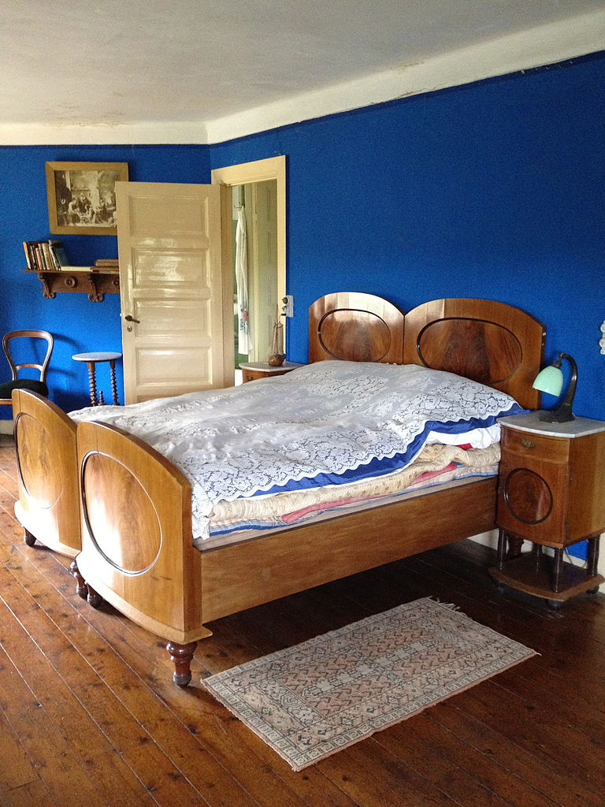

.. _semantic_ade20k:

**Semantic segmentation of images with PixelLib using Ade20k model**
=====================================================================

PixelLib is implemented with Deeplabv3+ framework to perform semantic segmentation. Xception model trained on ade20k dataset is used for semantic segmentation.

Download the xception model from `here <https://github.com/ayoolaolafenwa/PixelLib/releases/download/1.3/deeplabv3_xception65_ade20k.h5>`_.

*Code to implement semantic segmentation*:

.. code-block:: python

  import pixellib
  from pixellib.semantic import semantic_segmentation

  segment_video = semantic_segmentation()
  segment_video.load_ade20k_model("deeplabv3_xception65_ade20k.h5")
  segment_image.segmentAsAde20k("path_to_image", output_image_name= "path_to_output_image")

We shall take a look into each line of code.

.. code-block:: python

  import pixellib
  from pixellib.semantic import semantic_segmentation

  #created an instance of semantic segmentation class
  segment_image = semantic_segmentation()

The class for performing semantic segmentation is imported from pixellib and we created an instance of the class.

.. code-block:: python
  
  segment_video.load_ade20k_model("deeplabv3_xception65_ade20k.h5")

We called the function to load the xception model trained on ade20k dataset. 

.. code-block:: python

  segment_image.segmentAsAde20k("path_to_image", output_image_name= "path_to_output_image")

This is the line of code that performs segmentation on an image and the segmentation is done in the pascalvoc's color format. This function takes in two parameters:

  *path_to_image*: the path to the image to be segemented.

  *path_to_output_image*: the path to save the output image. The image will be saved in your current working directory.

**Sample1.jpg**  

.. image:: photos/ade_test1.jpg

.. code-block:: python

  import pixellib
  from pixellib.semantic import semantic_segmentation

  segment_video = semantic_segmentation()
  segment_video.load_ade20k_model("deeplabv3_xception65_ade20k.h5")
  segment_video.segmentAsAde20k("sample1.jpg", output_image_name="image_new.jpg")

.. image:: photos/ade_segmap.jpg  

Your saved image with all the objects present segmented.

You can obtain an image with segmentation overlay on the objects with a modified code below.

.. code-block:: python

  segment_image.segmentAsAde20k("sample1.jpg", output_image_name = "image_new.jpg", overlay = True)

We added an extra parameter **overlay** and set it to **true**, we produced an image with segmentation overlay.

.. image:: photos/ade_overlay.jpg

**Sample2.jpg**

.. code-block:: python
  
  segment_video.segmentAsAde20k("sample2.jpg", output_image_name="image_new2.jpg")

.. image:: photos/bedad1.jpg

**Specialised uses of PixelLib may require you to return the array of the segmentation's output.**

* Obtain the array of the segmentation's output by using this code, 

.. code-block:: python

  segvalues, output = segment_image.segmentAsAde20k()

* You can test the code for obtaining arrays and print out the shape of the output by modifying the semantic segmentation code below.

.. code-block:: python
  
  import pixellib
  from pixellib.semantic import semantic_segmentation
  import cv2

  segment_image = semantic_segmentation()
  segment_image.load_ade20k_model("deeplabv3_xception65_ade20k.h5")
  segvalues, output = segment_image.segmentAsAde20k("sample2.jpg")
  cv2.imwrite("img.jpg", output)
  print(output.shape)

**Note:** Access the *masks* of the objects segmented using **segvalues["masks"]** and their *class ids* using **segvalues["class_ids"]**.   

* Obtain both the output and the segmentation overlay's arrays by using this code,

.. code-block:: python

  segvalues, segoverlay = segment_image.segmentAsAde20k(overlay = True)

.. code-block:: python
  
  import pixellib
  from pixellib.semantic import semantic_segmentation
  import cv2

  segment_image = semantic_segmentation()
  segment_image.load_ade20k_model("deeplabv3_xception65_ade20k.h5")
  segvalues, segoverlay = segment_image.segmentAsAde20k("sample2.jpg", overlay= True)
  cv2.imwrite("img.jpg", segoverlay)
  print(segoverlay.shape)

This xception model is trained on ade20k dataset, a dataset with 150 object categories.

**Process opencv's frames**

.. code-block:: python

  import pixellib
  from pixellib.semantic import semantic_segmentation
  import cv2

  segment_frame = semantic_segmentation()
  segment_frame.load_ade20k_model("deeplabv3_xception65_ade20k.h5")

  capture = cv2.VideoCapture(0)
  while True:
    ret, frame = capture.read()
    segment_video.segmentFrameAsAde20k(frame)

  
